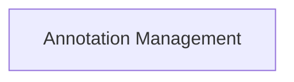

<!-- AUTO_GENERATED_PLACEHOLDER
  reason: LLM did not create .md file for this module
  module_path: developer_and_cli_tools/project_utilities/annotation_management
  component_count: 5
  generated_at: 2026-05-07T03:07:02.964513
-->

# Annotation Management

This module provides annotations for defining method execution hooks and specifying output formats for agents and tasks within the project.

<!-- DIAGRAM_JSON
{
    "direction": "TD",
    "nodes": [
        {
            "id": "annotation_management",
            "label": "Annotation Management",
            "type": "module",
            "title": "Annotation Management",
            "description": "This module provides annotations for defining method execution hooks and specifying output formats for agents and tasks within the project."
        }
    ],
    "edges": [],
    "groups": []
}
-->

