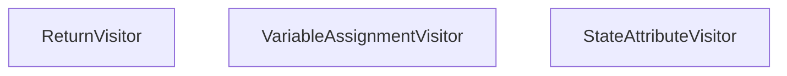

# ast_code_visitors
This module provides a collection of AST visitors designed to extract specific information from Python code, including return values, variable assignments, and state attribute comparisons.
<!-- DIAGRAM_JSON
{
  "nodes": [
    {"id": "ReturnVisitor", "label": "ReturnVisitor"},
    {"id": "VariableAssignmentVisitor", "label": "VariableAssignmentVisitor"},
    {"id": "StateAttributeVisitor", "label": "StateAttributeVisitor"}
  ],
  "edges": [],
  "groups": []
}
-->
