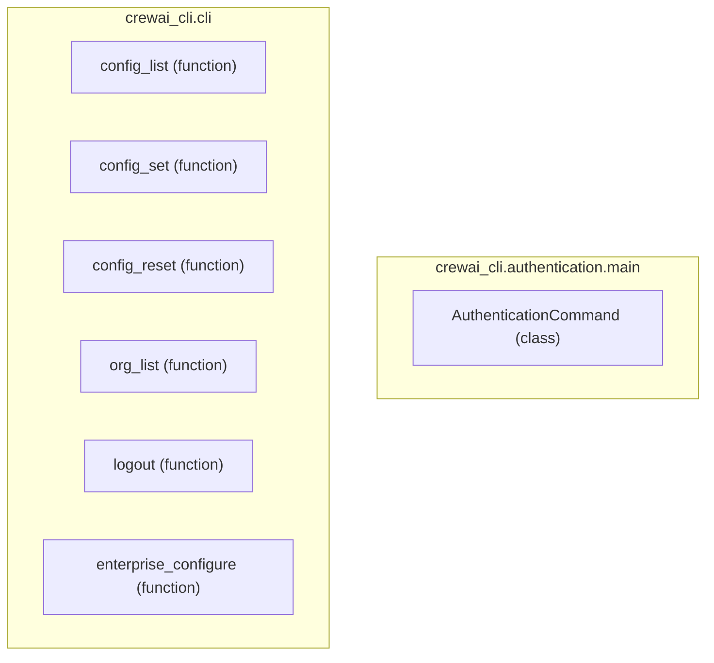

# authentication_settings
This module provides core CLI functionalities for user authentication, configuration management, organization listing, and enterprise settings within the CrewAI CLI.

<!-- DIAGRAM_JSON
{
    "nodes": [
        {
            "id": "AuthenticationCommand",
            "label": "AuthenticationCommand",
            "type": "class"
        },
        {
            "id": "config_list",
            "label": "config_list",
            "type": "function"
        },
        {
            "id": "config_set",
            "label": "config_set",
            "type": "function"
        },
        {
            "id": "config_reset",
            "label": "config_reset",
            "type": "function"
        },
        {
            "id": "org_list",
            "label": "org_list",
            "type": "function"
        },
        {
            "id": "logout",
            "label": "logout",
            "type": "function"
        },
        {
            "id": "enterprise_configure",
            "label": "enterprise_configure",
            "type": "function"
        }
    ],
    "edges": [],
    "groups": [
        {
            "id": "crewai_cli.authentication.main",
            "label": "crewai_cli.authentication.main",
            "nodes": [
                "AuthenticationCommand"
            ]
        },
        {
            "id": "crewai_cli.cli",
            "label": "crewai_cli.cli",
            "nodes": [
                "config_list",
                "config_set",
                "config_reset",
                "org_list",
                "logout",
                "enterprise_configure"
            ]
        }
    ]
}
-->
