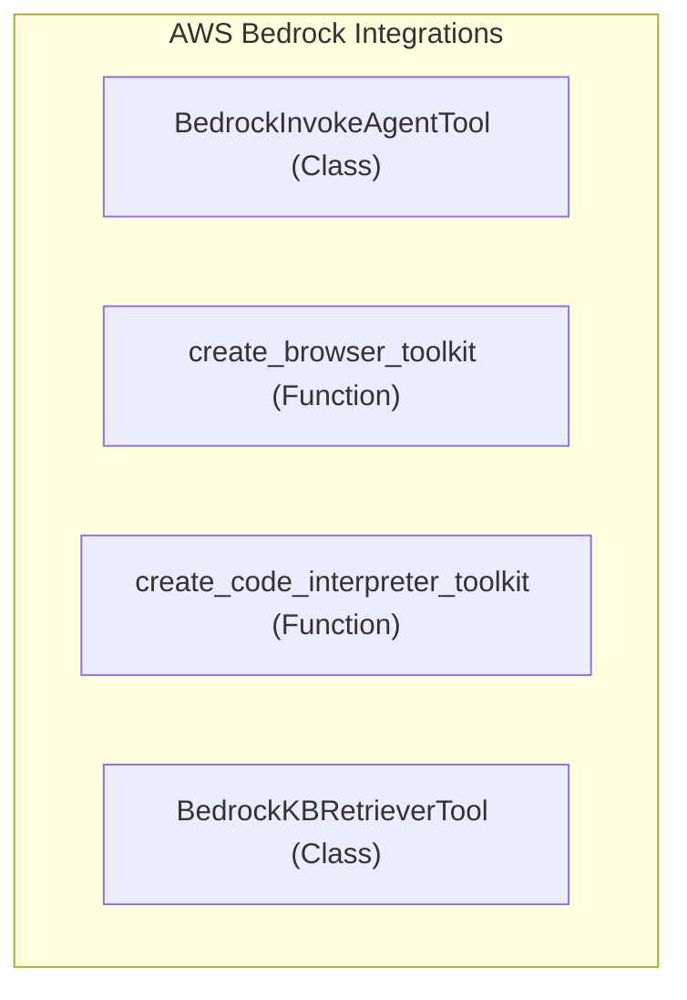

# aws_bedrock_integrations
This module provides a collection of tools and toolkit factories for integrating with various AWS Bedrock services, including agents, knowledge bases, browser interactions, and code interpretation.

<!-- DIAGRAM_JSON
{
    "nodes": [
        {
            "id": "BedrockInvokeAgentTool",
            "label": "BedrockInvokeAgentTool",
            "type": "class"
        },
        {
            "id": "create_browser_toolkit",
            "label": "create_browser_toolkit",
            "type": "function"
        },
        {
            "id": "create_code_interpreter_toolkit",
            "label": "create_code_interpreter_toolkit",
            "type": "function"
        },
        {
            "id": "BedrockKBRetrieverTool",
            "label": "BedrockKBRetrieverTool",
            "type": "class"
        }
    ],
    "edges": [],
    "groups": []
}
-->
