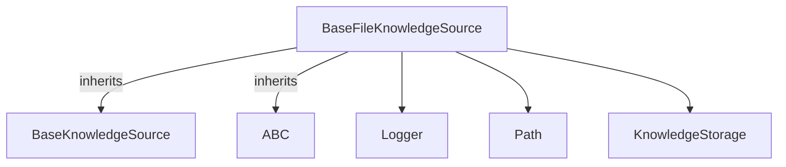

# base_file_handling
This module defines `BaseFileKnowledgeSource`, a base class for knowledge sources that load and manage content from files. It provides mechanisms for file path handling, content validation, and storage integration.

<!-- DIAGRAM_JSON
{
    "nodes": [
        {
            "id": "BaseFileKnowledgeSource",
            "label": "BaseFileKnowledgeSource",
            "type": "class"
        },
        {
            "id": "BaseKnowledgeSource",
            "label": "BaseKnowledgeSource",
            "type": "class"
        },
        {
            "id": "ABC",
            "label": "ABC",
            "type": "class"
        },
        {
            "id": "Logger",
            "label": "Logger",
            "type": "class"
        },
        {
            "id": "Path",
            "label": "Path",
            "type": "class"
        },
        {
            "id": "KnowledgeStorage",
            "label": "KnowledgeStorage",
            "type": "class"
        }
    ],
    "edges": [
        {
            "source": "BaseFileKnowledgeSource",
            "target": "BaseKnowledgeSource",
            "type": "inheritance"
        },
        {
            "source": "BaseFileKnowledgeSource",
            "target": "ABC",
            "type": "inheritance"
        },
        {
            "source": "BaseFileKnowledgeSource",
            "target": "Logger",
            "type": "uses"
        },
        {
            "source": "BaseFileKnowledgeSource",
            "target": "Path",
            "type": "uses"
        },
        {
            "source": "BaseFileKnowledgeSource",
            "target": "KnowledgeStorage",
            "type": "uses"
        }
    ],
    "groups": []
}
-->
