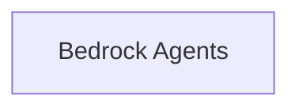

<!-- AUTO_GENERATED_PLACEHOLDER
  reason: LLM did not create .md file for this module
  module_path: tools_and_integrations/aws_bedrock_tools/bedrock_agents
  component_count: 1
  generated_at: 2026-05-07T03:07:02.961121
-->

# Bedrock Agents

Manages interactions with Amazon Bedrock agents, including invoking agents and handling session states for complex tasks.

<!-- DIAGRAM_JSON
{
    "direction": "TD",
    "nodes": [
        {
            "id": "bedrock_agents",
            "label": "Bedrock Agents",
            "type": "module",
            "title": "Bedrock Agents",
            "description": "Manages interactions with Amazon Bedrock agents, including invoking agents and handling session states for complex tasks."
        }
    ],
    "edges": [],
    "groups": []
}
-->

