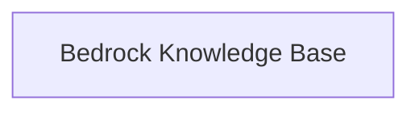

<!-- AUTO_GENERATED_PLACEHOLDER
  reason: LLM did not create .md file for this module
  module_path: tools_and_integrations/aws_bedrock_tools/bedrock_knowledge_base
  component_count: 1
  generated_at: 2026-05-07T03:07:02.960977
-->

# Bedrock Knowledge Base

Facilitates retrieving information from Amazon Bedrock Knowledge Bases, with features for query configuration and result processing.

<!-- DIAGRAM_JSON
{
    "direction": "TD",
    "nodes": [
        {
            "id": "bedrock_knowledge_base",
            "label": "Bedrock Knowledge Base",
            "type": "module",
            "title": "Bedrock Knowledge Base",
            "description": "Facilitates retrieving information from Amazon Bedrock Knowledge Bases, with features for query configuration and result processing."
        }
    ],
    "edges": [],
    "groups": []
}
-->

