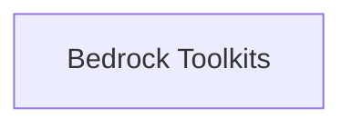

<!-- AUTO_GENERATED_PLACEHOLDER
  reason: LLM did not create .md file for this module
  module_path: tools_and_integrations/aws_bedrock_tools/bedrock_toolkits
  component_count: 2
  generated_at: 2026-05-07T03:07:02.961259
-->

# Bedrock Toolkits

Provides specialized toolkits for Amazon Bedrock services such as browser automation and code interpretation.

<!-- DIAGRAM_JSON
{
    "direction": "TD",
    "nodes": [
        {
            "id": "bedrock_toolkits",
            "label": "Bedrock Toolkits",
            "type": "module",
            "title": "Bedrock Toolkits",
            "description": "Provides specialized toolkits for Amazon Bedrock services such as browser automation and code interpretation."
        }
    ],
    "edges": [],
    "groups": []
}
-->

