# cache_management
This module provides functionalities for managing file caches, including synchronous and asynchronous cleanup operations, logging metrics, and handling cache-related annotations.

<!-- DIAGRAM_JSON
{
  "nodes": [
    {"id": "cleanup_expired_files", "label": "cleanup_expired_files"},
    {"id": "cleanup_provider_files", "label": "cleanup_provider_files"},
    {"id": "delete_expired", "label": "delete_expired"},
    {"id": "acleanup_provider_files", "label": "acleanup_provider_files"},
    {"id": "acleanup_uploaded_files", "label": "acleanup_uploaded_files"},
    {"id": "delete_one", "label": "delete_one"},
    {"id": "acleanup_expired_files", "label": "acleanup_expired_files"},
    {"id": "log_file_operation", "label": "log_file_operation"},
    {"id": "cleanup_on_exit", "label": "_cleanup_on_exit"},
    {"id": "cache_handler", "label": "cache_handler"},
    {"id": "UploadCache_ext", "label": "UploadCache (External)"},
    {"id": "FileOperationMetrics_ext", "label": "FileOperationMetrics (External)"},
    {"id": "CacheHandlerMethod_ext", "label": "CacheHandlerMethod (External)"},
    {"id": "memoize_ext", "label": "memoize (External)"},
    {"id": "cleanup_uploaded_files_ext", "label": "cleanup_uploaded_files (External)"}
  ],
  "edges": [
    {"source": "cleanup_expired_files", "target": "UploadCache_ext", "label": "manages"},
    {"source": "cleanup_provider_files", "target": "UploadCache_ext", "label": "manages"},
    {"source": "acleanup_expired_files", "target": "UploadCache_ext", "label": "manages"},
    {"source": "acleanup_expired_files", "target": "delete_expired", "label": "calls"},
    {"source": "acleanup_provider_files", "target": "UploadCache_ext", "label": "manages"},
    {"source": "acleanup_uploaded_files", "target": "UploadCache_ext", "label": "manages"},
    {"source": "acleanup_uploaded_files", "target": "delete_one", "label": "calls"},
    {"source": "log_file_operation", "target": "FileOperationMetrics_ext", "label": "uses"},
    {"source": "cleanup_on_exit", "target": "cleanup_uploaded_files_ext", "label": "calls"},
    {"source": "cache_handler", "target": "CacheHandlerMethod_ext", "label": "returns"},
    {"source": "cache_handler", "target": "memoize_ext", "label": "uses"}
  ],
  "groups": [
    {"id": "sync_cleanup", "label": "Sync Cleanup", "nodes": ["cleanup_expired_files", "cleanup_provider_files"]},
    {"id": "async_cleanup", "label": "Async Cleanup", "nodes": ["acleanup_expired_files", "acleanup_provider_files", "acleanup_uploaded_files"]},
    {"id": "async_helpers", "label": "Async Helpers", "nodes": ["delete_expired", "delete_one"]},
    {"id": "metrics", "label": "Metrics", "nodes": ["log_file_operation"]},
    {"id": "lifecycle", "label": "Lifecycle", "nodes": ["cleanup_on_exit"]},
    {"id": "annotations", "label": "Annotations", "nodes": ["cache_handler"]}
  ]
}
-->

```mermaid
flowchart TD
    subgraph Sync Cleanup
        cleanup_expired_files[cleanup_expired_files]
        cleanup_provider_files[cleanup_provider_files]
    end

    subgraph Async Cleanup
        acleanup_expired_files[acleanup_expired_files]
        acleanup_provider_files[acleanup_provider_files]
        acleanup_uploaded_files[acleanup_uploaded_files]
    end

    subgraph Async Helpers
        delete_expired[delete_expired]
        delete_one[delete_one]
    end

    subgraph Metrics
        log_file_operation[log_file_operation]
    end

    subgraph Lifecycle
        cleanup_on_exit[_cleanup_on_exit]
    end

    subgraph Annotations
        cache_handler[cache_handler]
    end

    subgraph External
        UploadCache_ext[UploadCache]
        FileOperationMetrics_ext[FileOperationMetrics]
        CacheHandlerMethod_ext[CacheHandlerMethod]
        memoize_ext[memoize]
        cleanup_uploaded_files_ext[cleanup_uploaded_files]
    end

    cleanup_expired_files --> UploadCache_ext
    cleanup_provider_files --> UploadCache_ext

    acleanup_expired_files --> UploadCache_ext
    acleanup_expired_files --> delete_expired
    acleanup_provider_files --> UploadCache_ext
    acleanup_uploaded_files --> UploadCache_ext
    acleanup_uploaded_files --> delete_one

    log_file_operation --> FileOperationMetrics_ext

    cleanup_on_exit --> cleanup_uploaded_files_ext

    cache_handler --> CacheHandlerMethod_ext
    cache_handler --> memoize_ext
```
