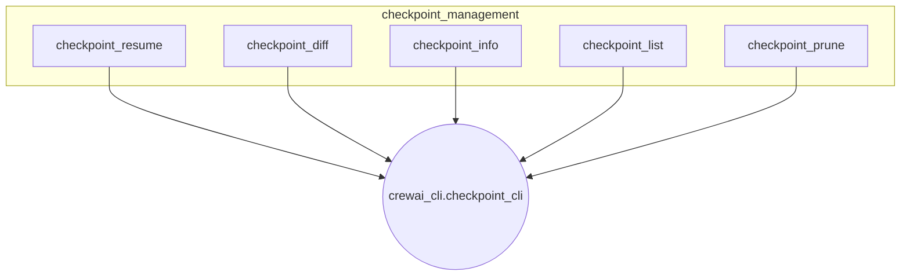

# checkpoint_management
This module provides a suite of command-line interface functions for managing checkpoints, including operations like resuming, comparing, viewing details, listing, and pruning old checkpoints.

<!-- DIAGRAM_JSON
{
    "nodes": [
        {
            "id": "checkpoint_resume",
            "label": "checkpoint_resume"
        },
        {
            "id": "checkpoint_diff",
            "label": "checkpoint_diff"
        },
        {
            "id": "checkpoint_info",
            "label": "checkpoint_info"
        },
        {
            "id": "checkpoint_list",
            "label": "checkpoint_list"
        },
        {
            "id": "checkpoint_prune",
            "label": "checkpoint_prune"
        },
        {
            "id": "checkpoint_cli",
            "label": "crewai_cli.checkpoint_cli",
            "type": "module"
        }
    ],
    "edges": [
        {
            "source": "checkpoint_resume",
            "target": "checkpoint_cli"
        },
        {
            "source": "checkpoint_diff",
            "target": "checkpoint_cli"
        },
        {
            "source": "checkpoint_info",
            "target": "checkpoint_cli"
        },
        {
            "source": "checkpoint_list",
            "target": "checkpoint_cli"
        },
        {
            "source": "checkpoint_prune",
            "target": "checkpoint_cli"
        }
    ],
    "groups": [
        {
            "id": "checkpoint_management",
            "label": "checkpoint_management",
            "nodes": [
                "checkpoint_resume",
                "checkpoint_diff",
                "checkpoint_info",
                "checkpoint_list",
                "checkpoint_prune"
            ]
        }
    ]
}
-->
