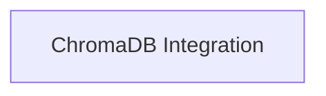

<!-- AUTO_GENERATED_PLACEHOLDER
  reason: LLM did not create .md file for this module
  module_path: data_and_files_management/rag_vector_stores/chromadb_integration
  component_count: 2
  generated_at: 2026-05-07T03:07:02.963410
-->

# ChromaDB Integration

Handles the integration with ChromaDB, providing default settings and client creation functionalities for persistent vector storage.

<!-- DIAGRAM_JSON
{
    "direction": "TD",
    "nodes": [
        {
            "id": "chromadb_integration",
            "label": "ChromaDB Integration",
            "type": "module",
            "title": "ChromaDB Integration",
            "description": "Handles the integration with ChromaDB, providing default settings and client creation functionalities for persistent vector storage."
        }
    ],
    "edges": [],
    "groups": []
}
-->

