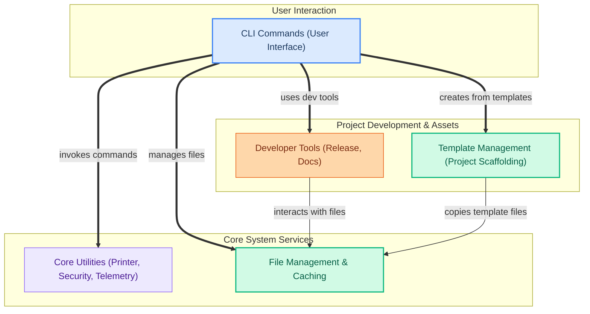

The `cli_and_utilities` module serves as the central interface for users to interact with the CrewAI framework through command-line tools. It provides a comprehensive set of functionalities for managing the entire lifecycle of CrewAI projects, from authentication and configuration to deployment, execution, and development utilities. This module streamlines common tasks, enabling users to efficiently create, manage, and operate their multi-agent systems.

Its core components work together to provide a robust command-line experience:
- **CLI Commands:** The main entry point for user interaction, orchestrating various operations.
- **File Management:** Handles file caching, cleanup, and resolution, supporting operations like tool creation and deployment.
- **Developer Tools:** Provides utilities for release management (version bumping, tagging) and documentation automation.
- **Core Utilities:** Offers foundational services such as console output formatting, security configuration, and telemetry.
- **Template Management:** Facilitates project scaffolding by managing and copying code templates for new crews and tools.

These components interact to provide a seamless user experience, allowing the CLI to manage project assets, execute commands, and provide feedback, all while leveraging underlying utility services.

<!-- DIAGRAM_JSON
{
    "direction": "TD",
    "nodes": [
        {
            "id": "cli_and_utilities",
            "label": "Cli And Utilities",
            "type": "module"
        },
        {
            "id": "cli_cmds",
            "label": "CLI Commands (User Interface)",
            "type": "module",
            "link": "cli_commands.md"
        },
        {
            "id": "core_utils",
            "label": "Core Utilities (Printer, Security, Telemetry)",
            "type": "module",
            "link": "core_utilities.md"
        },
        {
            "id": "file_mgmt",
            "label": "File Management & Caching",
            "type": "module",
            "link": "file_management.md"
        },
        {
            "id": "dev_tools",
            "label": "Developer Tools (Release, Docs)",
            "type": "module",
            "link": "developer_tools.md"
        },
        {
            "id": "tmpl_mgmt",
            "label": "Template Management (Project Scaffolding)",
            "type": "module",
            "link": "template_management.md"
        },
        {
            "id": "cli_commands",
            "label": "CLI Commands",
            "type": "module",
            "link": "cli_commands.md"
        },
        {
            "id": "file_management",
            "label": "File Management",
            "type": "module",
            "link": "file_management.md"
        },
        {
            "id": "developer_tools",
            "label": "Developer Tools",
            "type": "module",
            "link": "developer_tools.md"
        },
        {
            "id": "core_utilities",
            "label": "core_utilities",
            "type": "module",
            "link": "core_utilities.md"
        },
        {
            "id": "template_management",
            "label": "template_management",
            "type": "module",
            "link": "template_management.md"
        }
    ],
    "edges": [
        {
            "source": "cli_cmds",
            "target": "core_utils",
            "label": "invokes commands"
        },
        {
            "source": "cli_cmds",
            "target": "file_mgmt",
            "label": "manages files"
        },
        {
            "source": "cli_cmds",
            "target": "dev_tools",
            "label": "uses dev tools"
        },
        {
            "source": "cli_cmds",
            "target": "tmpl_mgmt",
            "label": "creates from templates"
        },
        {
            "source": "dev_tools",
            "target": "file_mgmt",
            "label": "interacts with files"
        },
        {
            "source": "tmpl_mgmt",
            "target": "file_mgmt",
            "label": "copies template files"
        },
        {
            "source": "cli_and_utilities",
            "target": "cli_commands"
        },
        {
            "source": "cli_and_utilities",
            "target": "file_management"
        },
        {
            "source": "cli_and_utilities",
            "target": "developer_tools"
        },
        {
            "source": "cli_and_utilities",
            "target": "core_utilities"
        },
        {
            "source": "cli_and_utilities",
            "target": "template_management"
        }
    ],
    "groups": [
        {
            "id": "user_interface",
            "label": "User Interaction",
            "nodes": [
                "cli_cmds"
            ]
        },
        {
            "id": "core_services",
            "label": "Core System Services",
            "nodes": [
                "core_utils",
                "file_mgmt"
            ]
        },
        {
            "id": "project_dev_assets",
            "label": "Project Development & Assets",
            "nodes": [
                "dev_tools",
                "tmpl_mgmt"
            ]
        }
    ]
}
-->

### Core Components Documentation:

*   **CLI Commands**: Provides the main command-line interface for all CrewAI operations, including authentication, deployment, execution, and various management tasks.
    *   [`lib.cli.src.crewai_cli.cli`](lib.cli.src.crewai_cli.cli.md)
    *   [`lib.cli.src.crewai_cli.authentication.main.AuthenticationCommand`](lib.cli.src.crewai_cli.authentication.main.AuthenticationCommand.md)
*   **File Management**: Manages file caching, cleanup, input normalization, and resolution strategies for efficient file handling within the CLI.
    *   [`lib.crewai-files.src.crewai_files.cache.cleanup`](lib.crewai-files.src.crewai_files.cache.cleanup.md)
    *   [`lib.crewai-files.src.crewai_files.resolution.resolver.create_resolver`](lib.crewai-files.src.crewai_files.resolution.resolver.create_resolver.md)
*   **Developer Tools**: Offers utilities for release management (e.g., `tag`, `bump`) and documentation automation (`docs_check`).
    *   [`lib.devtools.src.crewai_devtools.cli.tag`](lib.devtools.src.crewai_devtools.cli.tag.md)
    *   [`lib.devtools.src.crewai_devtools.docs_check.docs_check`](lib.devtools.src.crewai_devtools.docs_check.docs_check.md)
*   **Core Utilities**: Contains essential utility classes for console output (`Printer`), security configuration (`SecurityConfig`), and telemetry.
    *   [`lib.crewai-core.src.crewai_core.printer.Printer`](lib.crewai-core.src.crewai_core.printer.Printer.md)
    *   [`lib.crewai.src.crewai.security.security_config.SecurityConfig`](lib.crewai.src.crewai.security.security_config.SecurityConfig.md)
*   **Template Management**: Provides functionalities for managing and copying project templates, such as the `ContentCrew` example.
    *   [`lib.cli.src.crewai_cli.create_crew.copy_template_files`](lib.cli.src.crewai_cli.create_crew.copy_template_files.md)
    *   [`lib.cli.src.crewai_cli.templates.flow.crews.content_crew.content_crew.ContentCrew`](lib.cli.src.crewai_cli.templates.flow.crews.content_crew.content_crew.ContentCrew.md)