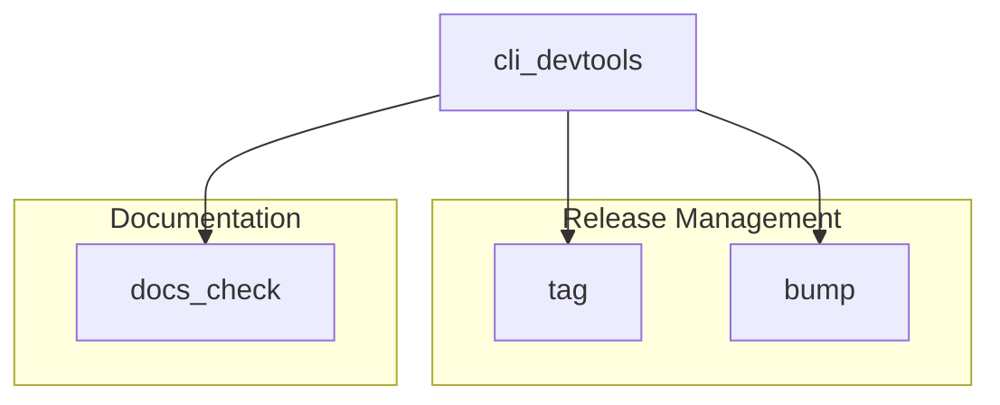

# cli_devtools
This module provides command-line interface tools for development operations, including version management (bumping and tagging releases) and automated documentation analysis and generation.

<!-- DIAGRAM_JSON
{
  "nodes": [
    {"id": "cli_devtools", "label": "cli_devtools"},
    {"id": "tag", "label": "tag"},
    {"id": "bump", "label": "bump"},
    {"id": "docs_check", "label": "docs_check"}
  ],
  "edges": [
    {"source": "cli_devtools", "target": "tag", "label": "contains"},
    {"source": "cli_devtools", "target": "bump", "label": "contains"},
    {"source": "cli_devtools", "target": "docs_check", "label": "contains"}
  ],
  "groups": [
    {"id": "release_management", "label": "Release Management", "nodes": ["tag", "bump"]},
    {"id": "documentation", "label": "Documentation", "nodes": ["docs_check"]}
  ]
}
-->
