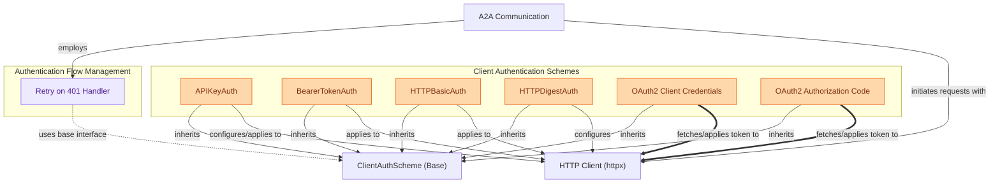

# Client Authentication Schemes

This module provides various client-side authentication schemes, including API Key, Bearer Token, HTTP Basic, HTTP Digest, and OAuth2 flows, and handles automatic retries for 401 authentication errors.

<!-- DIAGRAM_JSON
{
    "direction": "TD",
    "nodes": [
        {"id": "auth_base", "label": "ClientAuthScheme (Base)", "type": "component", "link": null},
        {"id": "api_key", "label": "APIKeyAuth", "type": "component", "link": null},
        {"id": "bearer_token", "label": "BearerTokenAuth", "type": "component", "link": null},
        {"id": "http_basic", "label": "HTTPBasicAuth", "type": "component", "link": null},
        {"id": "http_digest", "label": "HTTPDigestAuth", "type": "component", "link": null},
        {"id": "oauth2_cc", "label": "OAuth2 Client Credentials", "type": "component", "link": null},
        {"id": "oauth2_ac", "label": "OAuth2 Authorization Code", "type": "component", "link": null},
        {"id": "retry_handler", "label": "Retry on 401 Handler", "type": "component", "link": null},
        {"id": "http_client_lib", "label": "HTTP Client (httpx)", "type": "external", "link": null},
        {"id": "a2a_comm_module", "label": "A2A Communication", "type": "external", "link": "a2a_communication.md"}
    ],
    "edges": [
        {"source": "api_key", "target": "auth_base", "label": "inherits"},
        {"source": "bearer_token", "target": "auth_base", "label": "inherits"},
        {"source": "http_basic", "target": "auth_base", "label": "inherits"},
        {"source": "http_digest", "target": "auth_base", "label": "inherits"},
        {"source": "oauth2_cc", "target": "auth_base", "label": "inherits"},
        {"source": "oauth2_ac", "target": "auth_base", "label": "inherits"},
        {"source": "retry_handler", "target": "auth_base", "label": "uses base interface"},
        {"source": "a2a_comm_module", "target": "retry_handler", "label": "employs"},
        {"source": "retry_handler", "target": "http_client_lib", "label": "applies auth with"},
        {"source": "api_key", "target": "http_client_lib", "label": "configures/applies to"},
        {"source": "bearer_token", "target": "http_client_lib", "label": "applies to"},
        {"source": "http_basic", "target": "http_client_lib", "label": "applies to"},
        {"source": "http_digest", "target": "http_client_lib", "label": "configures"},
        {"source": "oauth2_cc", "target": "http_client_lib", "label": "fetches/applies token to"},
        {"source": "oauth2_ac", "target": "http_client_lib", "label": "fetches/applies token to"},
        {"source": "a2a_comm_module", "target": "http_client_lib", "label": "initiates requests with"}
    ],
    "groups": [
        {"id": "auth_schemes_grp", "label": "Client Authentication Schemes", "role": "generative", "nodes": ["api_key", "bearer_token", "http_basic", "http_digest", "oauth2_cc", "oauth2_ac"]},
        {"id": "auth_flow_grp", "label": "Authentication Flow Management", "role": "analytical", "nodes": ["retry_handler"]}
    ]
}
-->
