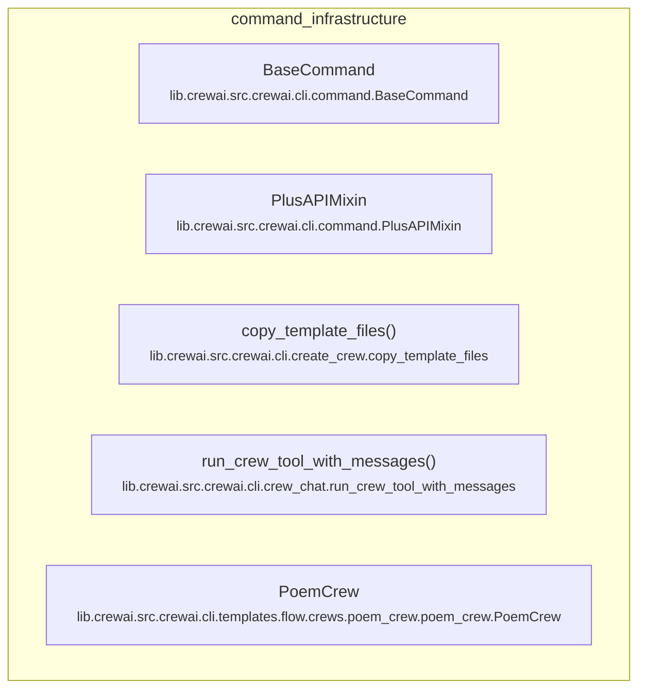

# command_infrastructure
This module provides core components for the CLI command infrastructure, including base command functionality, API integration, template handling, and example crew definitions.

<!-- DIAGRAM_JSON
{
  "nodes": [
    {
      "id": "BaseCommand",
      "label": "BaseCommand",
      "path": "lib.crewai.src.crewai.cli.command.BaseCommand"
    },
    {
      "id": "PlusAPIMixin",
      "label": "PlusAPIMixin",
      "path": "lib.crewai.src.crewai.cli.command.PlusAPIMixin"
    },
    {
      "id": "copy_template_files",
      "label": "copy_template_files",
      "path": "lib.crewai.src.crewai.cli.create_crew.copy_template_files"
    },
    {
      "id": "run_crew_tool_with_messages",
      "label": "run_crew_tool_with_messages",
      "path": "lib.crewai.src.crewai.cli.crew_chat.run_crew_tool_with_messages"
    },
    {
      "id": "PoemCrew",
      "label": "PoemCrew",
      "path": "lib.crewai.src.crewai.cli.templates.flow.crews.poem_crew.poem_crew.PoemCrew"
    }
  ],
  "edges": [],
  "groups": [
    {
      "id": "command_infrastructure",
      "label": "command_infrastructure",
      "contains": [
        "BaseCommand",
        "PlusAPIMixin",
        "copy_template_files",
        "run_crew_tool_with_messages",
        "PoemCrew"
      ]
    }
  ]
}
-->
