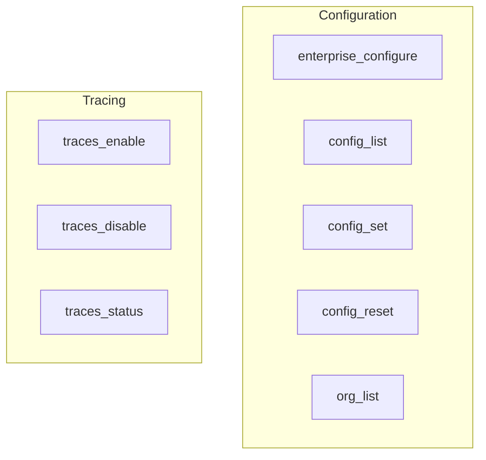

# configuration_and_tracing
This module provides CLI commands for managing CrewAI configuration parameters and controlling the collection and status of execution traces.

<!-- DIAGRAM_JSON
{
  "nodes": [
    {"id": "A", "label": "enterprise_configure"},
    {"id": "B", "label": "config_list"},
    {"id": "C", "label": "config_set"},
    {"id": "D", "label": "config_reset"},
    {"id": "E", "label": "org_list"},
    {"id": "F", "label": "traces_enable"},
    {"id": "G", "label": "traces_disable"},
    {"id": "H", "label": "traces_status"}
  ],
  "edges": [],
  "groups": [
    {"id": "configuration", "label": "Configuration", "nodes": ["A", "B", "C", "D", "E"]},
    {"id": "tracing", "label": "Tracing", "nodes": ["F", "G", "H"]}
  ]
}
-->
