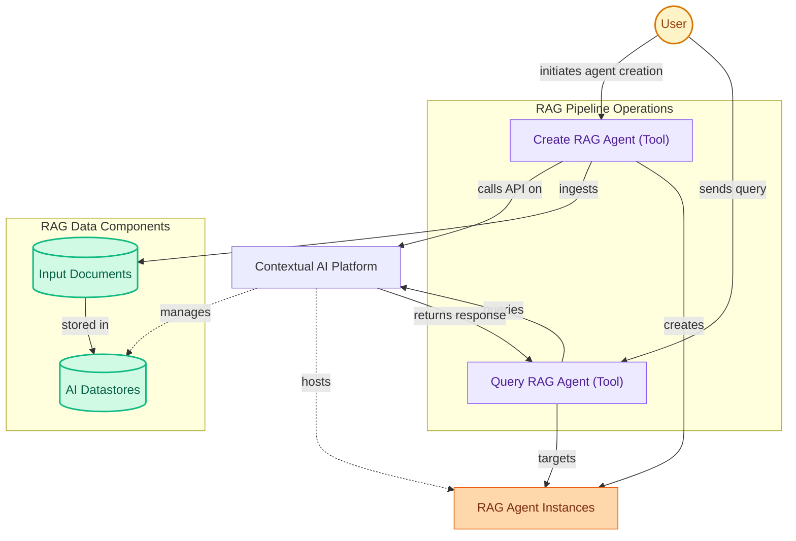

# Contextual AI RAG Tools
This module provides tools for creating and querying Contextual AI RAG agents. It enables users to manage document ingestion into datastores and retrieve information from configured agents.

<!-- DIAGRAM_JSON
{
    "direction": "TD",
    "nodes": [
        {"id": "user", "label": "User", "type": "external", "link": null},
        {"id": "create_tool", "label": "Create RAG Agent (Tool)", "type": "component", "link": null},
        {"id": "query_tool", "label": "Query RAG Agent (Tool)", "type": "component", "link": null},
        {"id": "contextual_ai_platform", "label": "Contextual AI Platform", "type": "external", "link": null},
        {"id": "input_documents", "label": "Input Documents", "type": "component", "link": null},
        {"id": "ai_datastores", "label": "AI Datastores", "type": "component", "link": null},
        {"id": "rag_agent_instances", "label": "RAG Agent Instances", "type": "component", "link": null}
    ],
    "edges": [
        {"source": "user", "target": "create_tool", "label": "initiates agent creation"},
        {"source": "user", "target": "query_tool", "label": "sends query"},
        {"source": "create_tool", "target": "contextual_ai_platform", "label": "calls API on"},
        {"source": "create_tool", "target": "input_documents", "label": "ingests"},
        {"source": "input_documents", "target": "ai_datastores", "label": "stored in"},
        {"source": "contextual_ai_platform", "target": "ai_datastores", "label": "manages"},
        {"source": "create_tool", "target": "rag_agent_instances", "label": "creates"},
        {"source": "contextual_ai_platform", "target": "rag_agent_instances", "label": "hosts"},
        {"source": "query_tool", "target": "contextual_ai_platform", "label": "queries"},
        {"source": "query_tool", "target": "rag_agent_instances", "label": "targets"},
        {"source": "contextual_ai_platform", "target": "query_tool", "label": "returns response"}
    ],
    "groups": [
        {"id": "rag_pipeline_ops", "label": "RAG Pipeline Operations", "role": "analytical", "nodes": ["create_tool", "query_tool"]},
        {"id": "rag_data_components", "label": "RAG Data Components", "role": "data", "nodes": ["input_documents", "ai_datastores"]}
    ]
}
-->
