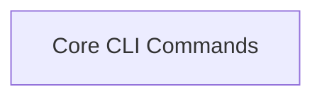

<!-- AUTO_GENERATED_PLACEHOLDER
  reason: LLM did not create .md file for this module
  module_path: developer_and_cli_tools/cli_commands/core_cli_commands
  component_count: 9
  generated_at: 2026-05-07T03:07:02.964244
-->

# Core CLI Commands

Provides fundamental CLI functionalities for running, chatting with, training, testing, and managing crew executions and task outputs.

<!-- DIAGRAM_JSON
{
    "direction": "TD",
    "nodes": [
        {
            "id": "core_cli_commands",
            "label": "Core CLI Commands",
            "type": "module",
            "title": "Core CLI Commands",
            "description": "Provides fundamental CLI functionalities for running, chatting with, training, testing, and managing crew executions and task outputs."
        }
    ],
    "edges": [],
    "groups": []
}
-->

