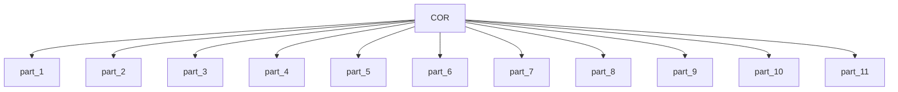

# Core Crew Management

This module contains 11 sub-modules:

- [part_1](part_1.md) - 5 components
- [part_2](part_2.md) - 2 components
- [part_3](part_3.md) - 2 components
- [part_4](part_4.md) - 2 components
- [part_5](part_5.md) - 2 components
- [part_6](part_6.md) - 2 components
- [part_7](part_7.md) - 2 components
- [part_8](part_8.md) - 2 components
- [part_9](part_9.md) - 11 components
- [part_10](part_10.md) - 16 components
- [part_11](part_11.md) - 5 components

## Architecture

