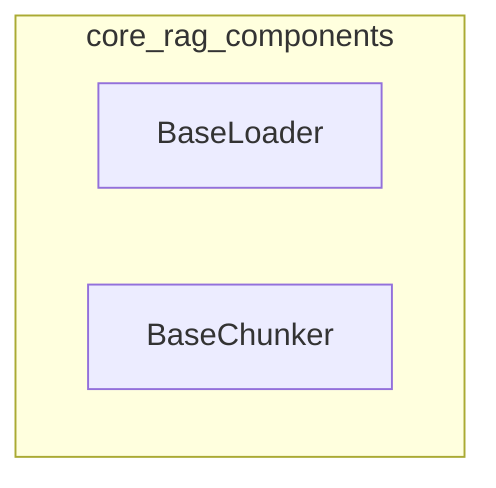

# core_rag_components
This module provides foundational components for Retrieval Augmented Generation (RAG) systems, including an abstract base class for loading diverse content and a configurable text chunker for processing documents.

<!-- DIAGRAM_JSON
{
    "nodes": [
        {
            "id": "BaseLoader",
            "label": "BaseLoader"
        },
        {
            "id": "BaseChunker",
            "label": "BaseChunker"
        }
    ],
    "edges": [],
    "groups": [
        {
            "id": "core_rag_components",
            "label": "core_rag_components",
            "nodes": [
                "BaseLoader",
                "BaseChunker"
            ]
        }
    ]
}
-->
