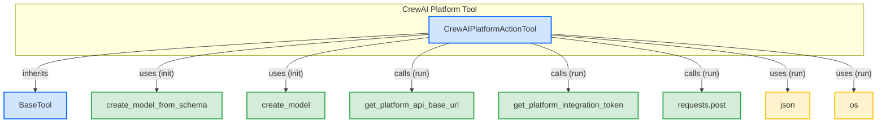

# crew_ai_platform_tool
The `crew_ai_platform_tool` module defines `CrewAIPlatformActionTool`, a class for executing actions on the CrewAI platform. It dynamically generates tool schemas from action definitions and manages API calls, authentication, and response processing.

<!-- DIAGRAM_JSON
{
    "nodes": [
        {
            "id": "CrewAIPlatformActionTool",
            "label": "CrewAIPlatformActionTool",
            "type": "class"
        },
        {
            "id": "BaseTool",
            "label": "BaseTool",
            "type": "class"
        },
        {
            "id": "create_model_from_schema",
            "label": "create_model_from_schema",
            "type": "function"
        },
        {
            "id": "create_model",
            "label": "create_model",
            "type": "function"
        },
        {
            "id": "get_platform_api_base_url",
            "label": "get_platform_api_base_url",
            "type": "function"
        },
        {
            "id": "get_platform_integration_token",
            "label": "get_platform_integration_token",
            "type": "function"
        },
        {
            "id": "requests_post",
            "label": "requests.post",
            "type": "function"
        },
        {
            "id": "json_lib",
            "label": "json",
            "type": "library"
        },
        {
            "id": "os_lib",
            "label": "os",
            "type": "library"
        }
    ],
    "edges": [
        {
            "source": "CrewAIPlatformActionTool",
            "target": "BaseTool",
            "label": "inherits"
        },
        {
            "source": "CrewAIPlatformActionTool",
            "target": "create_model_from_schema",
            "label": "uses (init)"
        },
        {
            "source": "CrewAIPlatformActionTool",
            "target": "create_model",
            "label": "uses (init)"
        },
        {
            "source": "CrewAIPlatformActionTool",
            "target": "get_platform_api_base_url",
            "label": "calls (run)"
        },
        {
            "source": "CrewAIPlatformActionTool",
            "target": "get_platform_integration_token",
            "label": "calls (run)"
        },
        {
            "source": "CrewAIPlatformActionTool",
            "target": "requests_post",
            "label": "calls (run)"
        },
        {
            "source": "CrewAIPlatformActionTool",
            "target": "json_lib",
            "label": "uses (run)"
        },
        {
            "source": "CrewAIPlatformActionTool",
            "target": "os_lib",
            "label": "uses (run)"
        }
    ],
    "groups": [
        {
            "id": "crew_ai_platform_tool",
            "label": "crew_ai_platform_tool",
            "nodes": [
                "CrewAIPlatformActionTool"
            ]
        }
    ]
}
-->
