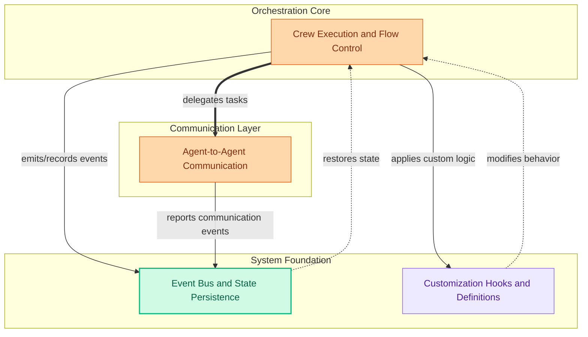

The `crew_orchestration` module serves as the central nervous system for CrewAI, enabling the creation, execution, and management of multi-agent systems. Its primary purpose is to orchestrate the collaborative efforts of autonomous agents, facilitating their communication, managing their state, and providing mechanisms for customization and extensibility. For the user, this module provides the core framework to define complex workflows, integrate various tools and LLMs, and ensure agents work cohesively towards a common goal.

The module's components work together to manage the entire lifecycle of a crew: from defining agent behaviors and inter-agent communication protocols to handling events, persisting state, and allowing for custom logic injection through hooks.

<!-- DIAGRAM_JSON
{
    "direction": "TD",
    "nodes": [
        {
            "id": "crew_orchestration",
            "label": "Crew Orchestration",
            "type": "module"
        },
        {
            "id": "core_mgmt",
            "label": "Crew Execution and Flow Control",
            "type": "module",
            "link": "core_crew_management.md"
        },
        {
            "id": "a2a_comm",
            "label": "Agent-to-Agent Communication",
            "type": "module",
            "link": "agent_to_agent_communication.md"
        },
        {
            "id": "event_state",
            "label": "Event Bus and State Persistence",
            "type": "module",
            "link": "event_and_state_management.md"
        },
        {
            "id": "hooks_anno",
            "label": "Customization Hooks and Definitions",
            "type": "module",
            "link": "hooks_and_annotations.md"
        },
        {
            "id": "core_crew_management",
            "label": "Core Crew Management",
            "type": "module",
            "link": "core_crew_management.md"
        },
        {
            "id": "agent_to_agent_communication",
            "label": "Agent-to-Agent Communication",
            "type": "module",
            "link": "agent_to_agent_communication.md"
        },
        {
            "id": "event_and_state_management",
            "label": "event_and_state_management",
            "type": "module",
            "link": "event_and_state_management.md"
        },
        {
            "id": "hooks_and_annotations",
            "label": "hooks_and_annotations",
            "type": "module",
            "link": "hooks_and_annotations.md"
        }
    ],
    "edges": [
        {
            "source": "core_mgmt",
            "target": "a2a_comm",
            "label": "delegates tasks"
        },
        {
            "source": "core_mgmt",
            "target": "event_state",
            "label": "emits/records events"
        },
        {
            "source": "core_mgmt",
            "target": "hooks_anno",
            "label": "applies custom logic"
        },
        {
            "source": "a2a_comm",
            "target": "event_state",
            "label": "reports communication events"
        },
        {
            "source": "event_state",
            "target": "core_mgmt",
            "label": "restores state"
        },
        {
            "source": "hooks_anno",
            "target": "core_mgmt",
            "label": "modifies behavior"
        },
        {
            "source": "crew_orchestration",
            "target": "core_crew_management"
        },
        {
            "source": "crew_orchestration",
            "target": "agent_to_agent_communication"
        },
        {
            "source": "crew_orchestration",
            "target": "event_and_state_management"
        },
        {
            "source": "crew_orchestration",
            "target": "hooks_and_annotations"
        }
    ],
    "groups": [
        {
            "id": "orchestration_core",
            "label": "Orchestration Core",
            "nodes": [
                "core_mgmt"
            ]
        },
        {
            "id": "communication_layer",
            "label": "Communication Layer",
            "nodes": [
                "a2a_comm"
            ]
        },
        {
            "id": "system_foundation",
            "label": "System Foundation",
            "nodes": [
                "event_state",
                "hooks_anno"
            ]
        }
    ]
}
-->

### Core Components Documentation

*   **[Core Crew Management](core_crew_management.md)**: This module defines the fundamental mechanisms for agent execution, flow control, and task management within a crew. It includes components for agent execution, tool handling, and flow lifecycle management.
*   **[Agent-to-Agent Communication](agent_to_agent_communication.md)**: Facilitates secure and robust communication between autonomous agents, covering authentication, configuration, various update mechanisms (polling, streaming, push notifications), and supporting extensions for inter-agent task delegation.
*   **[Event and State Management](event_and_state_management.md)**: Provides the core event system, including a singleton event bus, base event definitions, event context management, and mechanisms for event recording and state checkpointing to ensure flow continuity.
*   **[Hooks and Annotations](hooks_and_annotations.md)**: Offers a system for defining and managing various types of hooks (before/after LLM calls, before/after tool calls) using decorators and wrapper classes, enabling custom logic injection and structured definition of crew components.