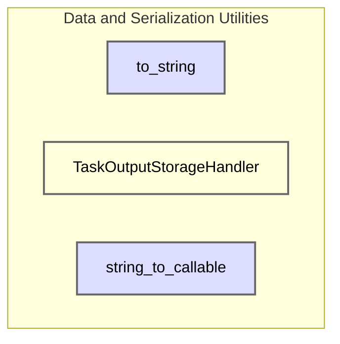

# data_and_serialization_utilities
This module provides utilities for object serialization to JSON strings, managing task output storage, and converting dotted-path strings to callable objects. It supports data persistence, replay, and dynamic function resolution.

<!-- DIAGRAM_JSON
{
  "nodes": [
    {"id": "to_string", "label": "to_string", "type": "function"},
    {"id": "TaskOutputStorageHandler", "label": "TaskOutputStorageHandler", "type": "class"},
    {"id": "string_to_callable", "label": "string_to_callable", "type": "function"}
  ],
  "edges": [],
  "groups": [
    {"id": "data_and_serialization_utilities", "label": "data_and_serialization_utilities", "nodes": ["to_string", "TaskOutputStorageHandler", "string_to_callable"]}
  ]
}
-->
