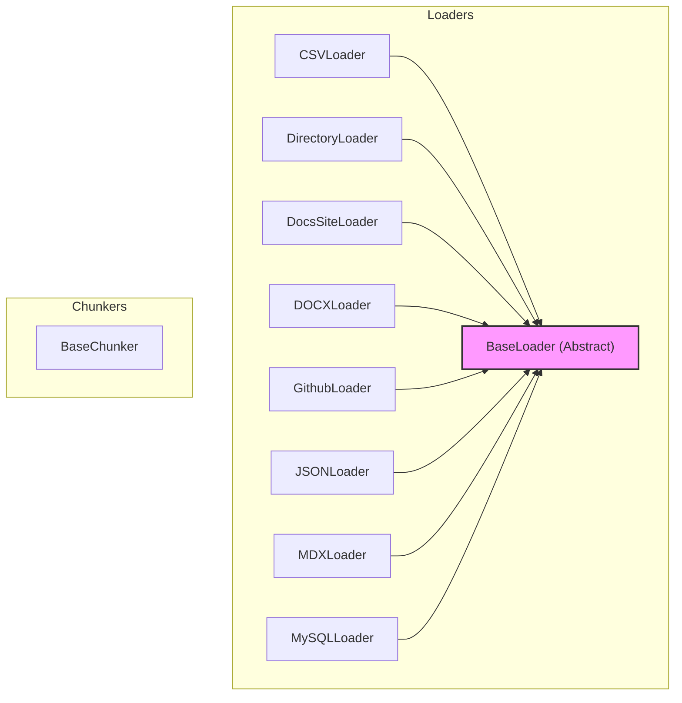

# data_loaders_and_chunkers
This module provides a collection of data loaders for various formats and sources, all inheriting from a common `BaseLoader`. It also includes a `BaseChunker` for text segmentation, facilitating efficient processing of diverse content types.

<!-- DIAGRAM_JSON
{
    "nodes": [
        {
            "id": "data_loaders_and_chunkers",
            "label": "data_loaders_and_chunkers",
            "type": "module"
        },
        {
            "id": "BaseLoader",
            "label": "BaseLoader",
            "type": "abstract"
        },
        {
            "id": "BaseChunker",
            "label": "BaseChunker"
        },
        {
            "id": "CSVLoader",
            "label": "CSVLoader"
        },
        {
            "id": "DirectoryLoader",
            "label": "DirectoryLoader"
        },
        {
            "id": "DocsSiteLoader",
            "label": "DocsSiteLoader"
        },
        {
            "id": "DOCXLoader",
            "label": "DOCXLoader"
        },
        {
            "id": "GithubLoader",
            "label": "GithubLoader"
        },
        {
            "id": "JSONLoader",
            "label": "JSONLoader"
        },
        {
            "id": "MDXLoader",
            "label": "MDXLoader"
        },
        {
            "id": "MySQLLoader",
            "label": "MySQLLoader"
        },
        {
            "id": "core_rag_components",
            "label": "Core RAG Components",
            "type": "module",
            "link": "core_rag_components.md"
        },
        {
            "id": "web_and_repository_loaders",
            "label": "Web & Repository Loaders",
            "type": "module",
            "link": "web_and_repository_loaders.md"
        },
        {
            "id": "document_and_file_loaders",
            "label": "Document & File Loaders",
            "type": "module",
            "link": "document_and_file_loaders.md"
        },
        {
            "id": "database_and_media_loaders",
            "label": "Database & Media Loaders",
            "type": "module",
            "link": "database_and_media_loaders.md"
        }
    ],
    "edges": [
        {
            "source": "CSVLoader",
            "target": "BaseLoader",
            "type": "inherits"
        },
        {
            "source": "DirectoryLoader",
            "target": "BaseLoader",
            "type": "inherits"
        },
        {
            "source": "DocsSiteLoader",
            "target": "BaseLoader",
            "type": "inherits"
        },
        {
            "source": "DOCXLoader",
            "target": "BaseLoader",
            "type": "inherits"
        },
        {
            "source": "GithubLoader",
            "target": "BaseLoader",
            "type": "inherits"
        },
        {
            "source": "JSONLoader",
            "target": "BaseLoader",
            "type": "inherits"
        },
        {
            "source": "MDXLoader",
            "target": "BaseLoader",
            "type": "inherits"
        },
        {
            "source": "MySQLLoader",
            "target": "BaseLoader",
            "type": "inherits"
        },
        {
            "source": "data_loaders_and_chunkers",
            "target": "core_rag_components"
        },
        {
            "source": "data_loaders_and_chunkers",
            "target": "web_and_repository_loaders"
        },
        {
            "source": "data_loaders_and_chunkers",
            "target": "document_and_file_loaders"
        },
        {
            "source": "data_loaders_and_chunkers",
            "target": "database_and_media_loaders"
        }
    ],
    "groups": [
        {
            "id": "Loaders",
            "label": "Loaders",
            "nodes": [
                "BaseLoader",
                "CSVLoader",
                "DirectoryLoader",
                "DocsSiteLoader",
                "DOCXLoader",
                "GithubLoader",
                "JSONLoader",
                "MDXLoader",
                "MySQLLoader"
            ]
        },
        {
            "id": "Chunkers",
            "label": "Chunkers",
            "nodes": [
                "BaseChunker"
            ]
        }
    ]
}
-->
```
