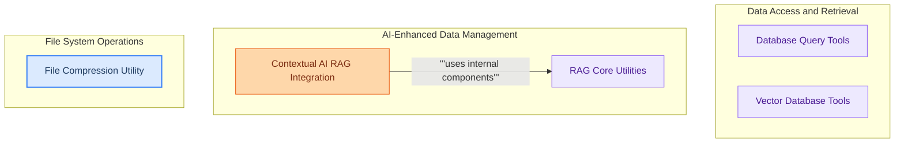

# Data Management Tools
This module provides a comprehensive suite of tools for data interaction, including querying various databases, performing vector searches, integrating with Contextual AI RAG agents, and managing file compression.

<!-- DIAGRAM_JSON
{
    "direction": "TD",
    "nodes": [
        {"id": "database_query_tools", "label": "Database Query Tools", "type": "module", "link": "database_query_tools.md"},
        {"id": "vector_database_tools", "label": "Vector Database Tools", "type": "module", "link": "vector_database_tools.md"},
        {"id": "contextual_ai_rag", "label": "Contextual AI RAG Integration", "type": "module", "link": "contextual_ai_rag.md"},
        {"id": "file_compression_utility", "label": "File Compression Utility", "type": "module", "link": "file_compression_utility.md"},
        {"id": "rag_core_utilities", "label": "RAG Core Utilities", "type": "module", "link": "rag_core_utilities.md"}
    ],
    "edges": [
        {"source": "contextual_ai_rag", "target": "rag_core_utilities", "label": "uses internal components"}
    ],
    "groups": [
        {"id": "data_access", "label": "Data Access and Retrieval", "role": "analytical", "nodes": ["database_query_tools", "vector_database_tools"]},
        {"id": "ai_data_management", "label": "AI-Enhanced Data Management", "role": "generative", "nodes": ["contextual_ai_rag", "rag_core_utilities"]},
        {"id": "file_ops", "label": "File System Operations", "role": "surface", "nodes": ["file_compression_utility"]}
    ]
}
-->
