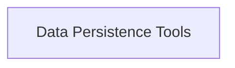

<!-- AUTO_GENERATED_PLACEHOLDER
  reason: LLM did not create .md file for this module
  module_path: tools_and_integrations/file_based_tools/data_persistence_tools
  component_count: 2
  generated_at: 2026-05-07T03:07:02.962237
-->

# Data Persistence Tools

Provides tools for interacting with databases, specifically MySQL, and for writing content to files.

<!-- DIAGRAM_JSON
{
    "direction": "TD",
    "nodes": [
        {
            "id": "data_persistence_tools",
            "label": "Data Persistence Tools",
            "type": "module",
            "title": "Data Persistence Tools",
            "description": "Provides tools for interacting with databases, specifically MySQL, and for writing content to files."
        }
    ],
    "edges": [],
    "groups": []
}
-->

