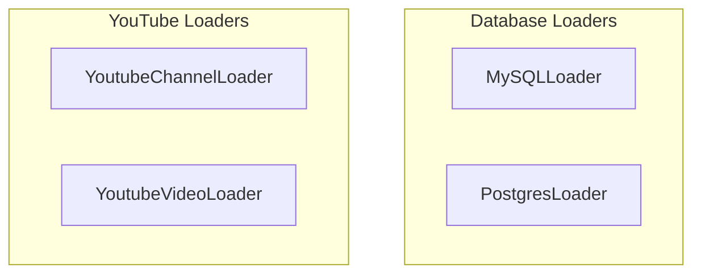

# database_and_media_loaders
This module provides specialized loaders for extracting content from various data sources, including MySQL and PostgreSQL databases, as well as YouTube channels and individual videos. It enables structured and unstructured data retrieval for RAG applications.

<!-- DIAGRAM_JSON
{
    "nodes": [
        {
            "id": "MySQLLoader",
            "label": "MySQLLoader",
            "type": "component"
        },
        {
            "id": "PostgresLoader",
            "label": "PostgresLoader",
            "type": "component"
        },
        {
            "id": "YoutubeChannelLoader",
            "label": "YoutubeChannelLoader",
            "type": "component"
        },
        {
            "id": "YoutubeVideoLoader",
            "label": "YoutubeVideoLoader",
            "type": "component"
        }
    ],
    "edges": [],
    "groups": [
        {
            "id": "database_loaders",
            "label": "Database Loaders",
            "nodes": [
                "MySQLLoader",
                "PostgresLoader"
            ]
        },
        {
            "id": "youtube_loaders",
            "label": "YouTube Loaders",
            "nodes": [
                "YoutubeChannelLoader",
                "YoutubeVideoLoader"
            ]
        }
    ]
}
-->
