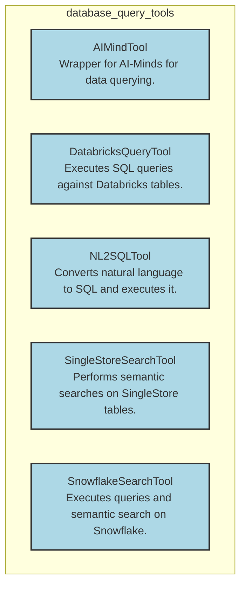

# database_query_tools
This module provides a collection of tools for interacting with various database systems, enabling SQL execution, natural language to SQL conversion, and semantic search capabilities across platforms like Databricks, Snowflake, SingleStore, and AI-Minds.

<!-- DIAGRAM_JSON
{
  "nodes": [
    {
      "id": "AIMindTool",
      "label": "AIMindTool",
      "description": "Wrapper for AI-Minds for data querying.",
      "type": "tool",
      "source_code": "lib.crewai-tools.src.crewai_tools.tools.ai_mind_tool.ai_mind_tool.AIMindTool"
    },
    {
      "id": "DatabricksQueryTool",
      "label": "DatabricksQueryTool",
      "description": "Executes SQL queries against Databricks tables.",
      "type": "tool",
      "source_code": "lib.crewai-tools.src.crewai_tools.tools.databricks_query_tool.databricks_query_tool.DatabricksQueryTool"
    },
    {
      "id": "NL2SQLTool",
      "label": "NL2SQLTool",
      "description": "Converts natural language to SQL and executes it.",
      "type": "tool",
      "source_code": "lib.crewai-tools.src.crewai_tools.tools.nl2sql.nl2sql_tool.NL2SQLTool"
    },
    {
      "id": "SingleStoreSearchTool",
      "label": "SingleStoreSearchTool",
      "description": "Performs semantic searches on SingleStore tables.",
      "type": "tool",
      "source_code": "lib.crewai-tools.src.crewai_tools.tools.singlestore_search_tool.singlestore_search_tool.SingleStoreSearchTool"
    },
    {
      "id": "SnowflakeSearchTool",
      "label": "SnowflakeSearchTool",
      "description": "Executes queries and semantic search on Snowflake.",
      "type": "tool",
      "source_code": "lib.crewai-tools.src.crewai_tools.tools.snowflake_search_tool.snowflake_search_tool.SnowflakeSearchTool"
    }
  ],
  "edges": [],
  "groups": [
    {
      "id": "database_query_tools",
      "label": "database_query_tools",
      "type": "module",
      "members": [
        "AIMindTool",
        "DatabricksQueryTool",
        "NL2SQLTool",
        "SingleStoreSearchTool",
        "SnowflakeSearchTool"
      ]
    }
  ]
}
-->
