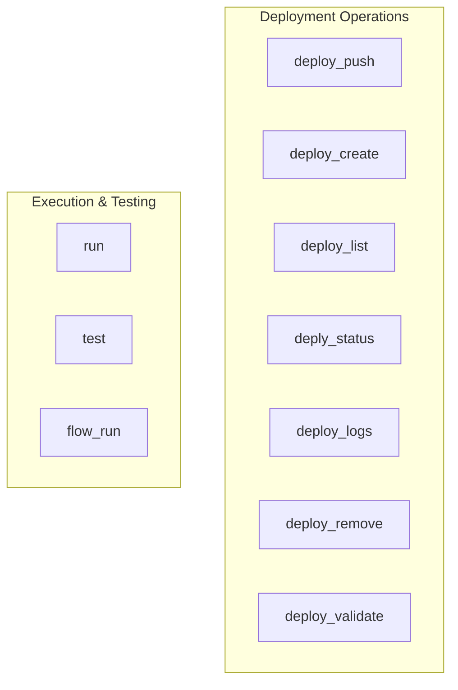

# deployment_execution
This module offers CLI functions for managing CrewAI deployments (create, list, status, logs, remove, validate) and executing/testing crews and flows.

<!-- DIAGRAM_JSON
{
    "nodes": [
        {
            "id": "deploy_push",
            "label": "deploy_push"
        },
        {
            "id": "deploy_create",
            "label": "deploy_create"
        },
        {
            "id": "deploy_list",
            "label": "deploy_list"
        },
        {
            "id": "deply_status",
            "label": "deply_status"
        },
        {
            "id": "deploy_logs",
            "label": "deploy_logs"
        },
        {
            "id": "deploy_remove",
            "label": "deploy_remove"
        },
        {
            "id": "deploy_validate",
            "label": "deploy_validate"
        },
        {
            "id": "run",
            "label": "run"
        },
        {
            "id": "test",
            "label": "test"
        },
        {
            "id": "flow_run",
            "label": "flow_run"
        }
    ],
    "edges": [],
    "groups": [
        {
            "id": "Deployment",
            "label": "Deployment Operations",
            "nodes": [
                "deploy_push",
                "deploy_create",
                "deploy_list",
                "deply_status",
                "deploy_logs",
                "deploy_remove",
                "deploy_validate"
            ]
        },
        {
            "id": "Execution",
            "label": "Execution & Testing",
            "nodes": [
                "run",
                "test",
                "flow_run"
            ]
        }
    ]
}
-->
