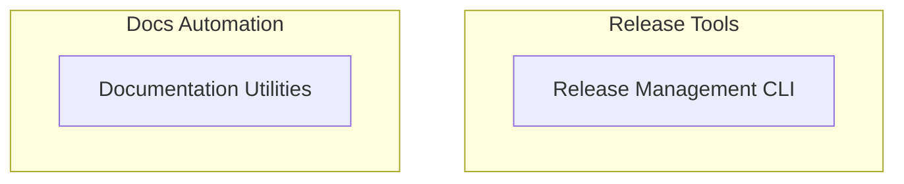

# Developer Tools
This module offers command-line utilities for managing software releases, including version bumping and Git tagging, alongside tools for analyzing code changes to automatically generate and translate documentation.

<!-- DIAGRAM_JSON
{
    "direction": "TD",
    "nodes": [
        {
            "id": "developer_tools",
            "label": "Developer Tools",
            "type": "module"
        },
        {
            "id": "release_management_cli",
            "label": "Release Management CLI",
            "type": "module",
            "link": "release_management_cli.md"
        },
        {
            "id": "documentation_utilities",
            "label": "Documentation Utilities",
            "type": "module",
            "link": "documentation_utilities.md"
        }
    ],
    "edges": [],
    "groups": [
        {
            "id": "release_tools",
            "label": "Release Tools",
            "role": "generative",
            "nodes": [
                "release_management_cli"
            ]
        },
        {
            "id": "docs_tools",
            "label": "Docs Automation",
            "role": "analytical",
            "nodes": [
                "documentation_utilities"
            ]
        }
    ]
}
-->
