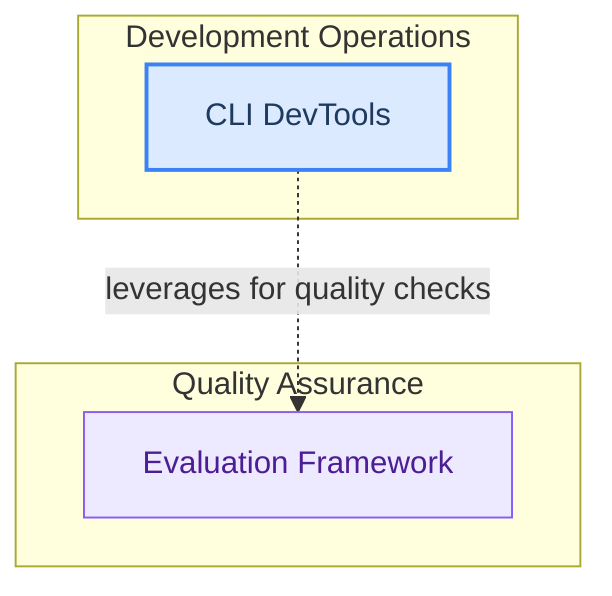

# DevTools and Evaluation
This module provides a suite of developer tools for managing project versions, facilitating release processes, and ensuring documentation quality, alongside an experimental framework for evaluating agent and crew performance.

<!-- DIAGRAM_JSON
{
    "direction": "TD",
    "nodes": [
        {"id": "cli_devtools", "label": "CLI DevTools", "type": "module", "link": "cli_devtools.md"},
        {"id": "evaluation_framework", "label": "Evaluation Framework", "type": "module", "link": "evaluation_framework.md"}
    ],
    "edges": [
        {"source": "cli_devtools", "target": "evaluation_framework", "label": "leverages for quality checks"}
    ],
    "groups": [
        {"id": "development_operations", "label": "Development Operations", "role": "surface", "nodes": ["cli_devtools"]},
        {"id": "quality_assurance", "label": "Quality Assurance", "role": "analytical", "nodes": ["evaluation_framework"]}
    ]
}
-->
