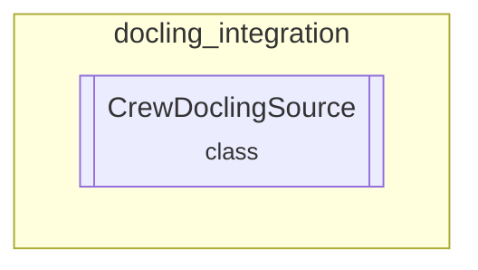

# docling_integration Module
Integrates `docling` for robust document conversion, supporting various formats like PDF, DOCX, and HTML, and extracting content for knowledge processing.

<!-- DIAGRAM_JSON
{
  "nodes": [
    {"id": "docling_integration", "label": "docling_integration", "type": "module"},
    {"id": "CrewDoclingSource", "label": "CrewDoclingSource", "type": "class"}
  ],
  "edges": [
    {"source": "docling_integration", "target": "CrewDoclingSource", "type": "contains"}
  ],
  "groups": [
    {"id": "docling_integration_group", "label": "docling_integration", "nodes": ["CrewDoclingSource"]}
  ]
}
-->
