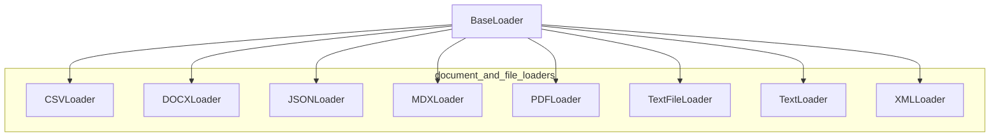

# document_and_file_loaders
This module provides a collection of specialized loaders for various document and file formats, including CSV, DOCX, JSON, MDX, PDF, plain text, and XML, facilitating their ingestion and parsing into a standardized `LoaderResult` format.
<!-- DIAGRAM_JSON
{
    "nodes": [
        {
            "id": "BaseLoader",
            "label": "BaseLoader",
            "type": "class"
        },
        {
            "id": "CSVLoader",
            "label": "CSVLoader",
            "type": "class"
        },
        {
            "id": "DOCXLoader",
            "label": "DOCXLoader",
            "type": "class"
        },
        {
            "id": "JSONLoader",
            "label": "JSONLoader",
            "type": "class"
        },
        {
            "id": "MDXLoader",
            "label": "MDXLoader",
            "type": "class"
        },
        {
            "id": "PDFLoader",
            "label": "PDFLoader",
            "type": "class"
        },
        {
            "id": "TextFileLoader",
            "label": "TextFileLoader",
            "type": "class"
        },
        {
            "id": "TextLoader",
            "label": "TextLoader",
            "type": "class"
        },
        {
            "id": "XMLLoader",
            "label": "XMLLoader",
            "type": "class"
        }
    ],
    "edges": [
        {
            "source": "BaseLoader",
            "target": "CSVLoader",
            "type": "inherits"
        },
        {
            "source": "BaseLoader",
            "target": "DOCXLoader",
            "type": "inherits"
        },
        {
            "source": "BaseLoader",
            "target": "JSONLoader",
            "type": "inherits"
        },
        {
            "source": "BaseLoader",
            "target": "MDXLoader",
            "type": "inherits"
        },
        {
            "source": "BaseLoader",
            "target": "PDFLoader",
            "type": "inherits"
        },
        {
            "source": "BaseLoader",
            "target": "TextFileLoader",
            "type": "inherits"
        },
        {
            "source": "BaseLoader",
            "target": "TextLoader",
            "type": "inherits"
        },
        {
            "source": "BaseLoader",
            "target": "XMLLoader",
            "type": "inherits"
        }
    ],
    "groups": [
        {
            "id": "document_and_file_loaders",
            "label": "document_and_file_loaders",
            "nodes": [
                "CSVLoader",
                "DOCXLoader",
                "JSONLoader",
                "MDXLoader",
                "PDFLoader",
                "TextFileLoader",
                "TextLoader",
                "XMLLoader"
            ]
        }
    ]
}
-->
