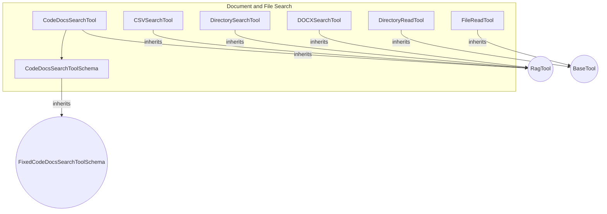

# document_and_file_search
This module provides a collection of tools for searching and reading various document and file types, including code documentation, CSVs, directories, DOCX files, and generic files.

<!-- DIAGRAM_JSON
{
    "nodes": [
        {
            "id": "CDST",
            "label": "CodeDocsSearchTool"
        },
        {
            "id": "CDSTS",
            "label": "CodeDocsSearchToolSchema"
        },
        {
            "id": "CST",
            "label": "CSVSearchTool"
        },
        {
            "id": "DRT",
            "label": "DirectoryReadTool"
        },
        {
            "id": "DST",
            "label": "DirectorySearchTool"
        },
        {
            "id": "DXST",
            "label": "DOCXSearchTool"
        },
        {
            "id": "FRT",
            "label": "FileReadTool"
        },
        {
            "id": "RagTool",
            "label": "RagTool",
            "type": "external"
        },
        {
            "id": "BaseTool",
            "label": "BaseTool",
            "type": "external"
        },
        {
            "id": "FixedCodeDocsSearchToolSchema",
            "label": "FixedCodeDocsSearchToolSchema",
            "type": "external"
        }
    ],
    "edges": [
        {
            "source": "CDST",
            "target": "RagTool",
            "type": "inheritance"
        },
        {
            "source": "CST",
            "target": "RagTool",
            "type": "inheritance"
        },
        {
            "source": "DST",
            "target": "RagTool",
            "type": "inheritance"
        },
        {
            "source": "DXST",
            "target": "RagTool",
            "type": "inheritance"
        },
        {
            "source": "DRT",
            "target": "BaseTool",
            "type": "inheritance"
        },
        {
            "source": "FRT",
            "target": "BaseTool",
            "type": "inheritance"
        },
        {
            "source": "CDST",
            "target": "CDSTS",
            "type": "uses"
        },
        {
            "source": "CDSTS",
            "target": "FixedCodeDocsSearchToolSchema",
            "type": "inheritance"
        }
    ],
    "groups": [
        {
            "id": "document_and_file_search",
            "label": "document_and_file_search",
            "nodes": [
                "CDST",
                "CDSTS",
                "CST",
                "DRT",
                "DST",
                "DXST",
                "FRT"
            ]
        }
    ]
}
-->
