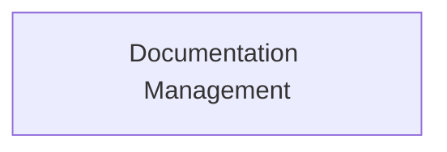

<!-- AUTO_GENERATED_PLACEHOLDER
  reason: LLM did not create .md file for this module
  module_path: developer_and_cli_tools/devtools_and_evaluation/development_tools/documentation_management
  component_count: 1
  generated_at: 2026-05-07T03:07:02.964783
-->

# Documentation Management

Analyzes code changes to determine documentation needs, and automates the generation and translation of documentation files.

<!-- DIAGRAM_JSON
{
    "direction": "TD",
    "nodes": [
        {
            "id": "documentation_management",
            "label": "Documentation Management",
            "type": "module",
            "title": "Documentation Management",
            "description": "Analyzes code changes to determine documentation needs, and automates the generation and translation of documentation files."
        }
    ],
    "edges": [],
    "groups": []
}
-->

