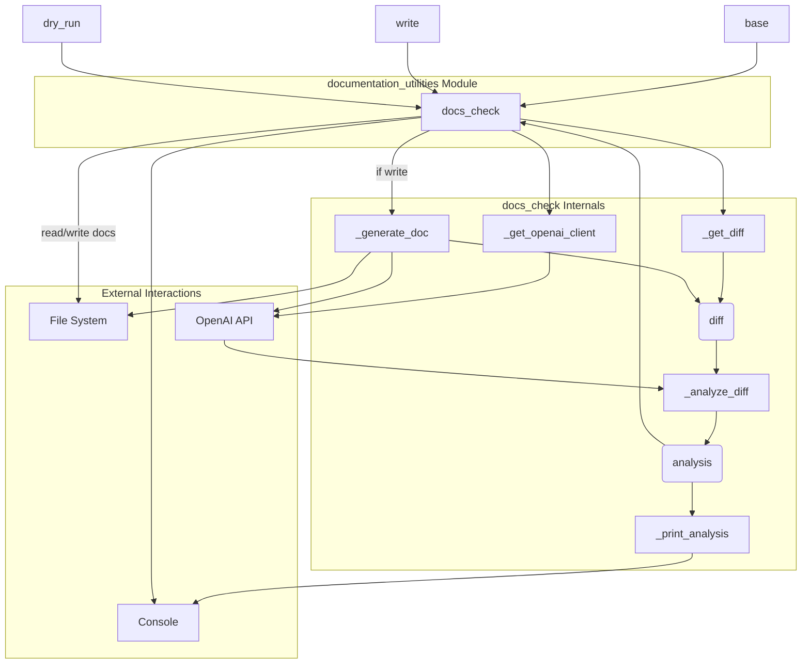

# documentation_utilities
This module provides utilities for managing documentation. Its `docs_check` function analyzes code changes to determine if documentation updates are needed, optionally generating and translating them.

<!-- DIAGRAM_JSON
{
    "nodes": [
        {
            "id": "M",
            "label": "documentation_utilities",
            "type": "module"
        },
        {
            "id": "F",
            "label": "docs_check",
            "type": "function"
        },
        {
            "id": "I1",
            "label": "base",
            "type": "input"
        },
        {
            "id": "I2",
            "label": "write",
            "type": "input"
        },
        {
            "id": "I3",
            "label": "dry_run",
            "type": "input"
        },
        {
            "id": "H1",
            "label": "_get_diff",
            "type": "helper"
        },
        {
            "id": "H2",
            "label": "_get_openai_client",
            "type": "helper"
        },
        {
            "id": "H3",
            "label": "_analyze_diff",
            "type": "helper"
        },
        {
            "id": "H4",
            "label": "_print_analysis",
            "type": "helper"
        },
        {
            "id": "H5",
            "label": "_generate_doc",
            "type": "helper"
        },
        {
            "id": "D",
            "label": "diff",
            "type": "data"
        },
        {
            "id": "A",
            "label": "analysis",
            "type": "data"
        },
        {
            "id": "E1",
            "label": "Console",
            "type": "external"
        },
        {
            "id": "E2",
            "label": "File System",
            "type": "external"
        },
        {
            "id": "E3",
            "label": "OpenAI API",
            "type": "external"
        }
    ],
    "edges": [
        {
            "source": "I1",
            "target": "F"
        },
        {
            "source": "I2",
            "target": "F"
        },
        {
            "source": "I3",
            "target": "F"
        },
        {
            "source": "F",
            "target": "H1"
        },
        {
            "source": "H1",
            "target": "D"
        },
        {
            "source": "D",
            "target": "H3"
        },
        {
            "source": "F",
            "target": "H2"
        },
        {
            "source": "H2",
            "target": "E3"
        },
        {
            "source": "E3",
            "target": "H3"
        },
        {
            "source": "H3",
            "target": "A"
        },
        {
            "source": "A",
            "target": "H4"
        },
        {
            "source": "H4",
            "target": "E1"
        },
        {
            "source": "A",
            "target": "F"
        },
        {
            "source": "F",
            "target": "E1"
        },
        {
            "source": "F",
            "target": "H5",
            "label": "if write"
        },
        {
            "source": "H5",
            "target": "D"
        },
        {
            "source": "H5",
            "target": "E3"
        },
        {
            "source": "H5",
            "target": "E2"
        },
        {
            "source": "F",
            "target": "E2",
            "label": "read/write docs"
        }
    ],
    "groups": [
        {
            "id": "G1",
            "label": "documentation_utilities Module",
            "nodes": [
                "F"
            ]
        },
        {
            "id": "G2",
            "label": "docs_check Internals",
            "nodes": [
                "H1",
                "H2",
                "H3",
                "H4",
                "H5",
                "D",
                "A"
            ]
        },
        {
            "id": "G3",
            "label": "External Interactions",
            "nodes": [
                "E1",
                "E2",
                "E3"
            ]
        }
    ]
}
-->
