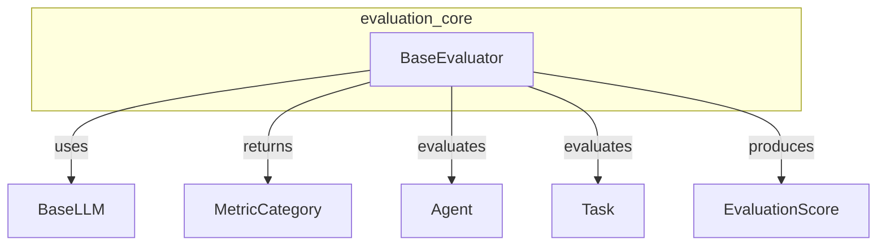

# evaluation_core
The `evaluation_core` module defines `BaseEvaluator`, an abstract base class for creating custom evaluation metrics. It provides a framework for assessing agent performance and task outcomes.

<!-- DIAGRAM_JSON
{
    "nodes": [
        {
            "id": "evaluation_core_BaseEvaluator",
            "label": "BaseEvaluator",
            "type": "class"
        },
        {
            "id": "crewai_BaseLLM",
            "label": "BaseLLM",
            "type": "class"
        },
        {
            "id": "crewai_MetricCategory",
            "label": "MetricCategory",
            "type": "enum"
        },
        {
            "id": "crewai_Agent",
            "label": "Agent",
            "type": "class"
        },
        {
            "id": "crewai_Task",
            "label": "Task",
            "type": "class"
        },
        {
            "id": "crewai_EvaluationScore",
            "label": "EvaluationScore",
            "type": "class"
        }
    ],
    "edges": [
        {
            "source": "evaluation_core_BaseEvaluator",
            "target": "crewai_BaseLLM",
            "label": "uses"
        },
        {
            "source": "evaluation_core_BaseEvaluator",
            "target": "crewai_MetricCategory",
            "label": "returns"
        },
        {
            "source": "evaluation_core_BaseEvaluator",
            "target": "crewai_Agent",
            "label": "evaluates"
        },
        {
            "source": "evaluation_core_BaseEvaluator",
            "target": "crewai_Task",
            "label": "evaluates"
        },
        {
            "source": "evaluation_core_BaseEvaluator",
            "target": "crewai_EvaluationScore",
            "label": "produces"
        }
    ],
    "groups": []
}
-->
