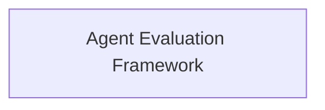

<!-- AUTO_GENERATED_PLACEHOLDER
  reason: LLM did not create .md file for this module
  module_path: developer_and_cli_tools/devtools_and_evaluation/evaluation_framework
  component_count: 3
  generated_at: 2026-05-07T03:07:02.964649
-->

# Agent Evaluation Framework

Offers an experimental framework for evaluating agent performance and outcomes, including running experiments and asserting their success against baselines.

<!-- DIAGRAM_JSON
{
    "direction": "TD",
    "nodes": [
        {
            "id": "evaluation_framework",
            "label": "Agent Evaluation Framework",
            "type": "module",
            "title": "Agent Evaluation Framework",
            "description": "Offers an experimental framework for evaluating agent performance and outcomes, including running experiments and asserting their success against baselines."
        }
    ],
    "edges": [],
    "groups": []
}
-->

