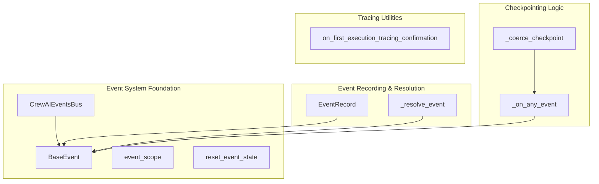

# event_and_state_management
This module provides core event management capabilities, including a singleton event bus, base event definitions, event context management, and mechanisms for event recording and state checkpointing.

<!-- DIAGRAM_JSON
{
    "nodes": [
        {
            "id": "A",
            "label": "BaseEvent",
            "component": "class"
        },
        {
            "id": "B",
            "label": "CrewAIEventsBus",
            "component": "class"
        },
        {
            "id": "C",
            "label": "event_scope",
            "component": "function"
        },
        {
            "id": "D",
            "label": "reset_event_state",
            "component": "function"
        },
        {
            "id": "E",
            "label": "on_first_execution_tracing_confirmation",
            "component": "function"
        },
        {
            "id": "F",
            "label": "_coerce_checkpoint",
            "component": "function"
        },
        {
            "id": "G",
            "label": "_on_any_event",
            "component": "function"
        },
        {
            "id": "H",
            "label": "EventRecord",
            "component": "class"
        },
        {
            "id": "I",
            "label": "_resolve_event",
            "component": "function"
        }
    ],
    "edges": [
        {
            "source": "B",
            "target": "A",
            "label": "manages/emits"
        },
        {
            "source": "H",
            "target": "A",
            "label": "stores"
        },
        {
            "source": "G",
            "target": "A",
            "label": "processes"
        },
        {
            "source": "I",
            "target": "A",
            "label": "produces"
        },
        {
            "source": "F",
            "target": "G",
            "label": "enables"
        }
    ],
    "groups": [
        {
            "id": "event_system_foundation",
            "label": "Event System Foundation",
            "nodes": [
                "A",
                "B",
                "C",
                "D"
            ]
        },
        {
            "id": "event_recording_resolution",
            "label": "Event Recording & Resolution",
            "nodes": [
                "H",
                "I"
            ]
        },
        {
            "id": "checkpointing_logic",
            "label": "Checkpointing Logic",
            "nodes": [
                "F",
                "G"
            ]
        },
        {
            "id": "tracing_utilities",
            "label": "Tracing Utilities",
            "nodes": [
                "E"
            ]
        }
    ]
}
-->
