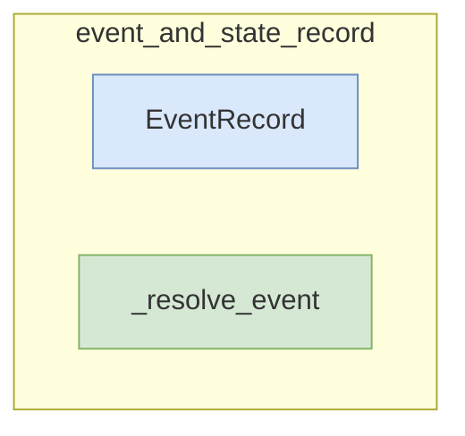

# event_and_state_record
This module provides a directed record for managing execution events and a utility function for resolving event types.

<!-- DIAGRAM_JSON
{
  "nodes": [
    {
      "id": "EventRecord",
      "label": "EventRecord",
      "type": "class"
    },
    {
      "id": "_resolve_event",
      "label": "_resolve_event",
      "type": "function"
    }
  ],
  "edges": [],
  "groups": [
    {
      "id": "event_and_state_record",
      "label": "event_and_state_record",
      "contains": ["EventRecord", "_resolve_event"]
    }
  ]
}
-->
