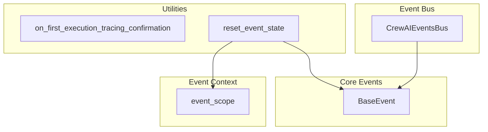

# event_bus_core
This module provides the foundational event system for CrewAI, including base event definitions, a singleton event bus for dispatching, and utilities for event context management and testing.

<!-- DIAGRAM_JSON
{
  "nodes": [
    {
      "id": "BaseEvent",
      "label": "BaseEvent",
      "type": "class"
    },
    {
      "id": "CrewAIEventsBus",
      "label": "CrewAIEventsBus",
      "type": "class"
    },
    {
      "id": "event_scope",
      "label": "event_scope",
      "type": "function"
    },
    {
      "id": "on_first_execution_tracing_confirmation",
      "label": "on_first_execution_tracing_confirmation",
      "type": "function"
    },
    {
      "id": "reset_event_state",
      "label": "reset_event_state",
      "type": "function"
    }
  ],
  "edges": [
    {
      "source": "CrewAIEventsBus",
      "target": "BaseEvent",
      "label": "manages/emits"
    },
    {
      "source": "reset_event_state",
      "target": "BaseEvent",
      "label": "resets counter"
    },
    {
      "source": "reset_event_state",
      "target": "event_scope",
      "label": "resets context"
    }
  ],
  "groups": [
    {
      "id": "Core Events",
      "label": "Core Events",
      "nodes": [
        "BaseEvent"
      ]
    },
    {
      "id": "Event Bus",
      "label": "Event Bus",
      "nodes": [
        "CrewAIEventsBus"
      ]
    },
    {
      "id": "Event Context",
      "label": "Event Context",
      "nodes": [
        "event_scope"
      ]
    },
    {
      "id": "Utilities",
      "label": "Utilities",
      "nodes": [
        "on_first_execution_tracing_confirmation",
        "reset_event_state"
      ]
    }
  ]
}
-->
```
