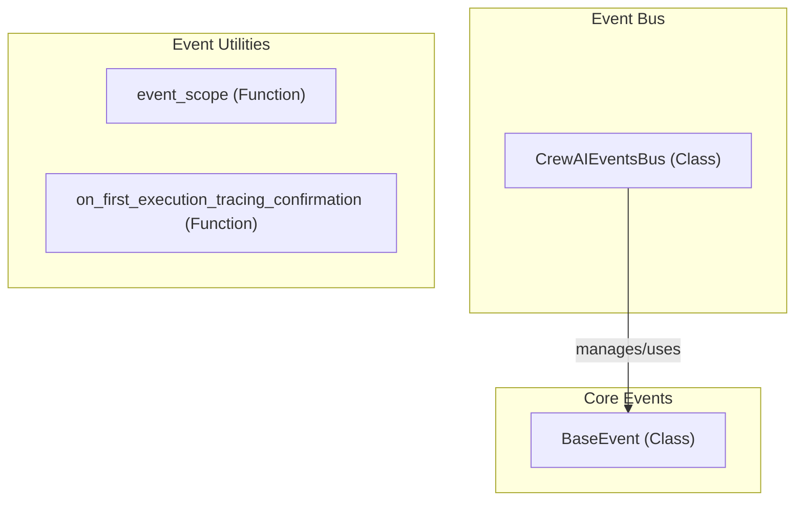

# event_system
The `event_system` module defines the base event structure, implements a singleton event bus for dispatching events, and includes utilities for managing event scopes and initial tracing setup.

<!-- DIAGRAM_JSON
{
  "nodes": [
    {"id": "BaseEvent", "label": "BaseEvent", "type": "class"},
    {"id": "CrewAIEventsBus", "label": "CrewAIEventsBus", "type": "class"},
    {"id": "event_scope", "label": "event_scope", "type": "function"},
    {"id": "on_first_execution_tracing_confirmation", "label": "on_first_execution_tracing_confirmation", "type": "function"}
  ],
  "edges": [
    {"source": "CrewAIEventsBus", "target": "BaseEvent", "label": "manages/uses"}
  ],
  "groups": [
    {"id": "core_events", "label": "Core Events", "nodes": ["BaseEvent"]},
    {"id": "event_bus", "label": "Event Bus", "nodes": ["CrewAIEventsBus"]},
    {"id": "event_utilities", "label": "Event Utilities", "nodes": ["event_scope", "on_first_execution_tracing_confirmation"]}
  ]
}
-->
