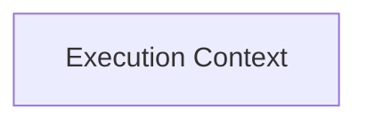

<!-- AUTO_GENERATED_PLACEHOLDER
  reason: LLM did not create .md file for this module
  module_path: crewai_core_framework/eventing_and_context/execution_context
  component_count: 3
  generated_at: 2026-05-07T03:07:02.959875
-->

# Execution Context

Provides mechanisms for capturing and applying the current execution state, including task and flow identifiers, event stacks, and emission sequences.

<!-- DIAGRAM_JSON
{
    "direction": "TD",
    "nodes": [
        {
            "id": "execution_context",
            "label": "Execution Context",
            "type": "module",
            "title": "Execution Context",
            "description": "Provides mechanisms for capturing and applying the current execution state, including task and flow identifiers, event stacks, and emission sequences."
        }
    ],
    "edges": [],
    "groups": []
}
-->

