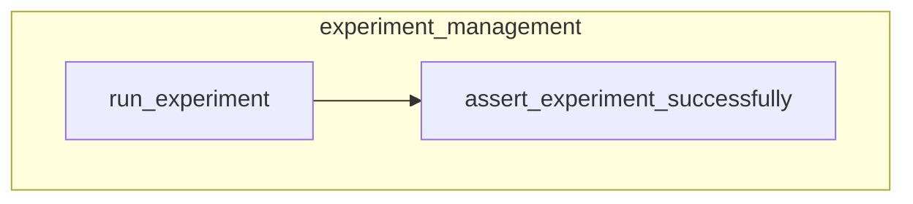

# experiment_management
Provides utilities for executing and validating experiments, including running a set of tests and asserting their successful completion against baselines.

<!-- DIAGRAM_JSON
{
    "nodes": [
        {
            "id": "run_experiment",
            "label": "run_experiment"
        },
        {
            "id": "assert_experiment_successfully",
            "label": "assert_experiment_successfully"
        }
    ],
    "edges": [
        {
            "source": "run_experiment",
            "target": "assert_experiment_successfully",
            "label": "ExperimentResults"
        }
    ],
    "groups": [
        {
            "id": "experiment_management",
            "label": "experiment_management",
            "nodes": [
                "run_experiment",
                "assert_experiment_successfully"
            ]
        }
    ]
}
-->
