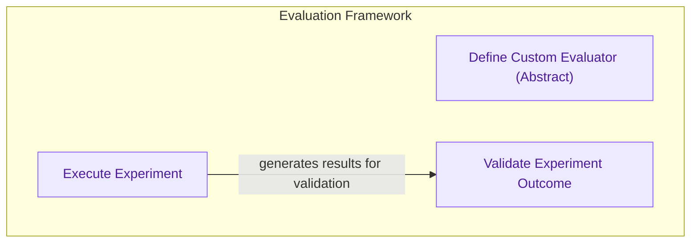

The `experimental_features` module introduces advanced capabilities for evaluating and testing multi-agent systems within CrewAI. It provides a structured framework for defining custom evaluation metrics, orchestrating experiments, and validating the performance and outcomes of agents and crews against predefined baselines. This module is crucial for developers and researchers looking to rigorously test, benchmark, and improve the reliability and effectiveness of their AI crews.

### How it Works

The module's core functionality revolves around an evaluation framework that allows users to define how agent and crew performance is measured. Experiments can be executed, and their results are then validated to ensure they meet desired criteria.

<!-- DIAGRAM_JSON
{
    "direction": "TD",
    "nodes": [
        {
            "id": "experimental_features",
            "label": "Experimental Features",
            "type": "module"
        },
        {
            "id": "define_evaluator",
            "label": "Define Custom Evaluator (Abstract)",
            "type": "class",
            "link": "lib.crewai.src.crewai.experimental.evaluation.base_evaluator.md"
        },
        {
            "id": "execute_experiment",
            "label": "Execute Experiment",
            "type": "function",
            "link": "lib.crewai.src.crewai.experimental.evaluation.testing.run_experiment.md"
        },
        {
            "id": "validate_outcome",
            "label": "Validate Experiment Outcome",
            "type": "function",
            "link": "lib.crewai.src.crewai.experimental.evaluation.testing.assert_experiment_successfully.md"
        },
        {
            "id": "evaluation_framework",
            "label": "evaluation_framework",
            "type": "module",
            "link": "evaluation_framework.md"
        }
    ],
    "edges": [
        {
            "source": "execute_experiment",
            "target": "validate_outcome",
            "label": "generates results for validation"
        },
        {
            "source": "experimental_features",
            "target": "evaluation_framework"
        }
    ],
    "groups": [
        {
            "id": "evaluation_framework_group",
            "label": "Evaluation Framework",
            "nodes": [
                "define_evaluator",
                "execute_experiment",
                "validate_outcome"
            ]
        }
    ]
}
-->

### Core Components

*   **`BaseEvaluator`**: An abstract base class that serves as the foundation for creating custom evaluation metrics and logic. It allows users to define their own criteria for assessing agent and crew performance.
    *   [Documentation for `BaseEvaluator`](lib.crewai.src.crewai.experimental.evaluation.base_evaluator.md)
*   **`run_experiment()`**: A utility function to orchestrate and execute experiments. It takes an agent or crew, a dataset, and an evaluator, then runs the experiment and collects results.
    *   [Documentation for `run_experiment()`](lib.crewai.src.crewai.experimental.evaluation.testing.run_experiment.md)
*   **`assert_experiment_successfully()`**: A function used to validate the outcomes of an experiment. It checks if the results meet the success criteria defined by the evaluator, providing a clear pass/fail indication.
    *   [Documentation for `assert_experiment_successfully()`](lib.crewai.src.crewai.experimental.evaluation.testing.assert_experiment_successfully.md)