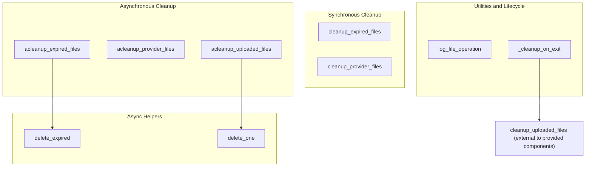

# file_cache_and_cleanup
This module provides functions for managing and cleaning up cached files, including synchronous and asynchronous operations for expiring files, clearing provider-specific files, and handling cleanup on application exit. It also includes a utility for structured logging of file operations.

<!-- DIAGRAM_JSON
{
    "nodes": [
        {
            "id": "CEF",
            "label": "cleanup_expired_files"
        },
        {
            "id": "CPF",
            "label": "cleanup_provider_files"
        },
        {
            "id": "DE",
            "label": "delete_expired"
        },
        {
            "id": "ACPF",
            "label": "acleanup_provider_files"
        },
        {
            "id": "ACUF",
            "label": "acleanup_uploaded_files"
        },
        {
            "id": "DO",
            "label": "delete_one"
        },
        {
            "id": "ACEF",
            "label": "acleanup_expired_files"
        },
        {
            "id": "LFO",
            "label": "log_file_operation"
        },
        {
            "id": "COE",
            "label": "_cleanup_on_exit"
        },
        {
            "id": "cleanup_uploaded_files",
            "label": "cleanup_uploaded_files",
            "type": "external",
            "_repaired": "g2_injected_endpoint"
        }
    ],
    "edges": [
        {
            "source": "ACEF",
            "target": "DE",
            "label": "calls"
        },
        {
            "source": "ACUF",
            "target": "DO",
            "label": "calls"
        },
        {
            "source": "COE",
            "target": "cleanup_uploaded_files",
            "label": "calls (external to provided components)"
        }
    ],
    "groups": [
        {
            "id": "sync_cleanup",
            "label": "Synchronous Cleanup",
            "nodes": [
                "CEF",
                "CPF"
            ]
        },
        {
            "id": "async_cleanup",
            "label": "Asynchronous Cleanup",
            "nodes": [
                "ACEF",
                "ACPF",
                "ACUF"
            ]
        },
        {
            "id": "async_helpers",
            "label": "Async Helpers",
            "nodes": [
                "DE",
                "DO"
            ]
        },
        {
            "id": "utilities_lifecycle",
            "label": "Utilities & Lifecycle",
            "nodes": [
                "LFO",
                "COE"
            ]
        }
    ]
}
-->
