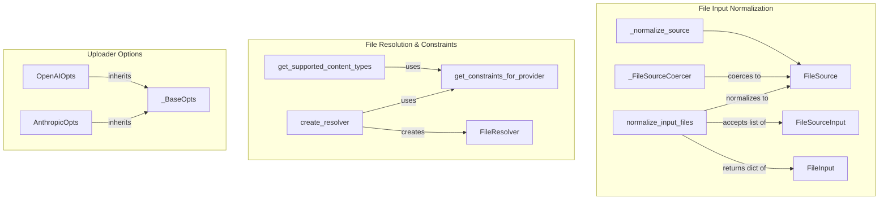

# file_input_and_resolution
This module provides utilities for normalizing diverse file inputs into a consistent `FileSource` format, resolving file handling strategies based on provider constraints, and defining specific options for different file uploaders.

<!-- DIAGRAM_JSON
{
    "nodes": [
        {
            "id": "_normalize_source",
            "label": "_normalize_source",
            "type": "function"
        },
        {
            "id": "_FileSourceCoercer",
            "label": "_FileSourceCoercer",
            "type": "class"
        },
        {
            "id": "get_supported_content_types",
            "label": "get_supported_content_types",
            "type": "function"
        },
        {
            "id": "create_resolver",
            "label": "create_resolver",
            "type": "function"
        },
        {
            "id": "normalize_input_files",
            "label": "normalize_input_files",
            "type": "function"
        },
        {
            "id": "OpenAIOpts",
            "label": "OpenAIOpts",
            "type": "class"
        },
        {
            "id": "AnthropicOpts",
            "label": "AnthropicOpts",
            "type": "class"
        },
        {
            "id": "FileSource",
            "label": "FileSource",
            "type": "type"
        },
        {
            "id": "get_constraints_for_provider",
            "label": "get_constraints_for_provider",
            "type": "function"
        },
        {
            "id": "FileResolver",
            "label": "FileResolver",
            "type": "class"
        },
        {
            "id": "FileInput",
            "label": "FileInput",
            "type": "type"
        },
        {
            "id": "FileSourceInput",
            "label": "FileSourceInput",
            "type": "type"
        },
        {
            "id": "_BaseOpts",
            "label": "_BaseOpts",
            "type": "class"
        }
    ],
    "edges": [
        {
            "source": "_normalize_source",
            "target": "FileSource",
            "label": "returns"
        },
        {
            "source": "_FileSourceCoercer",
            "target": "FileSource",
            "label": "coerces to"
        },
        {
            "source": "get_supported_content_types",
            "target": "get_constraints_for_provider",
            "label": "uses"
        },
        {
            "source": "create_resolver",
            "target": "get_constraints_for_provider",
            "label": "uses"
        },
        {
            "source": "create_resolver",
            "target": "FileResolver",
            "label": "creates"
        },
        {
            "source": "normalize_input_files",
            "target": "FileInput",
            "label": "returns dict of"
        },
        {
            "source": "normalize_input_files",
            "target": "FileSourceInput",
            "label": "accepts list of"
        },
        {
            "source": "normalize_input_files",
            "target": "FileSource",
            "label": "normalizes to"
        },
        {
            "source": "OpenAIOpts",
            "target": "_BaseOpts",
            "label": "inherits"
        },
        {
            "source": "AnthropicOpts",
            "target": "_BaseOpts",
            "label": "inherits"
        }
    ],
    "groups": [
        {
            "id": "file_input_normalization",
            "label": "File Input Normalization",
            "nodes": [
                "_normalize_source",
                "_FileSourceCoercer",
                "normalize_input_files"
            ]
        },
        {
            "id": "file_resolution_constraints",
            "label": "File Resolution & Constraints",
            "nodes": [
                "get_supported_content_types",
                "create_resolver"
            ]
        },
        {
            "id": "uploader_options",
            "label": "Uploader Options",
            "nodes": [
                "OpenAIOpts",
                "AnthropicOpts"
            ]
        }
    ]
}
-->
