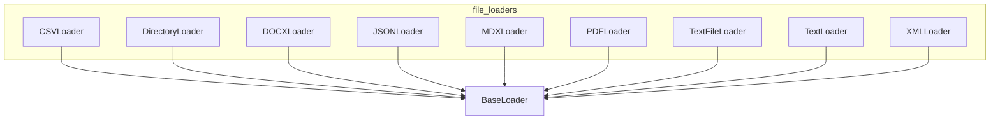

# file_loaders
This module provides a collection of specialized loaders for various file formats and data sources. It includes loaders for CSV, DOCX, JSON, MDX, PDF, XML, and plain text files, as well as a directory loader.

<!-- DIAGRAM_JSON
{
  "nodes": [
    {"id": "BaseLoader", "label": "BaseLoader", "type": "class"},
    {"id": "CSVLoader", "label": "CSVLoader", "type": "class"},
    {"id": "DirectoryLoader", "label": "DirectoryLoader", "type": "class"},
    {"id": "DOCXLoader", "label": "DOCXLoader", "type": "class"},
    {"id": "JSONLoader", "label": "JSONLoader", "type": "class"},
    {"id": "MDXLoader", "label": "MDXLoader", "type": "class"},
    {"id": "PDFLoader", "label": "PDFLoader", "type": "class"},
    {"id": "TextFileLoader", "label": "TextFileLoader", "type": "class"},
    {"id": "TextLoader", "label": "TextLoader", "type": "class"},
    {"id": "XMLLoader", "label": "XMLLoader", "type": "class"}
  ],
  "edges": [
    {"source": "CSVLoader", "target": "BaseLoader", "type": "inherits"},
    {"source": "DirectoryLoader", "target": "BaseLoader", "type": "inherits"},
    {"source": "DOCXLoader", "target": "BaseLoader", "type": "inherits"},
    {"source": "JSONLoader", "target": "BaseLoader", "type": "inherits"},
    {"source": "MDXLoader", "target": "BaseLoader", "type": "inherits"},
    {"source": "PDFLoader", "target": "BaseLoader", "type": "inherits"},
    {"source": "TextFileLoader", "target": "BaseLoader", "type": "inherits"},
    {"source": "TextLoader", "target": "BaseLoader", "type": "inherits"},
    {"source": "XMLLoader", "target": "BaseLoader", "type": "inherits"}
  ],
  "groups": [
    {"id": "file_loaders", "label": "file_loaders", "members": ["CSVLoader", "DirectoryLoader", "DOCXLoader", "JSONLoader", "MDXLoader", "PDFLoader", "TextFileLoader", "TextLoader", "XMLLoader"]}
  ]
}
-->
