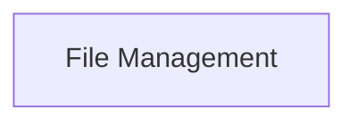

<!-- AUTO_GENERATED_PLACEHOLDER
  reason: LLM did not create .md file for this module
  module_path: tools_and_integrations/file_based_tools/file_management
  component_count: 1
  generated_at: 2026-05-07T03:07:02.961683
-->

# File Management

Includes tools dedicated to writing and managing files on the local filesystem.

<!-- DIAGRAM_JSON
{
    "direction": "TD",
    "nodes": [
        {
            "id": "file_management",
            "label": "File Management",
            "type": "module",
            "title": "File Management",
            "description": "Includes tools dedicated to writing and managing files on the local filesystem."
        }
    ],
    "edges": [],
    "groups": []
}
-->

