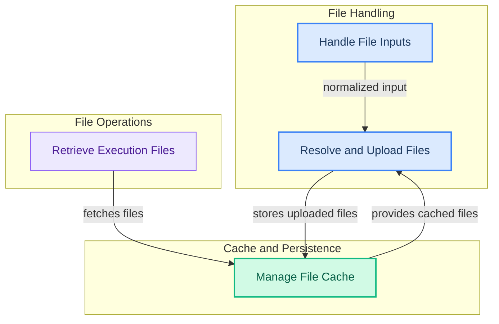

# File Processing and Cache Management
This module provides functionalities for handling various file inputs, managing file uploads with caching, and ensuring efficient cleanup of temporary or expired files from different providers, alongside utilities for retrieving files related to ongoing executions.

<!-- DIAGRAM_JSON
{
    "direction": "TD",
    "nodes": [
        {"id": "file_source_handling", "label": "Handle File Inputs", "type": "module", "link": "file_source_handling.md"},
        {"id": "file_resolution_and_uploads", "label": "Resolve and Upload Files", "type": "module", "link": "file_resolution_and_uploads.md"},
        {"id": "cache_management", "label": "Manage File Cache", "type": "module", "link": "cache_management.md"},
        {"id": "execution_file_retrieval", "label": "Retrieve Execution Files", "type": "module", "link": "execution_file_retrieval.md"}
    ],
    "edges": [
        {"source": "file_source_handling", "target": "file_resolution_and_uploads", "label": "normalized input"},
        {"source": "file_resolution_and_uploads", "target": "cache_management", "label": "stores uploaded files"},
        {"source": "cache_management", "target": "file_resolution_and_uploads", "label": "provides cached files"},
        {"source": "execution_file_retrieval", "target": "cache_management", "label": "fetches files"}
    ],
    "groups": [
        {"id": "file_handling_group", "label": "File Handling", "role": "surface", "nodes": ["file_source_handling", "file_resolution_and_uploads"]},
        {"id": "cache_and_persistence_group", "label": "Cache and Persistence", "role": "data", "nodes": ["cache_management"]},
        {"id": "file_operations_group", "label": "File Operations", "role": "analytical", "nodes": ["execution_file_retrieval"]}
    ]
}
-->
